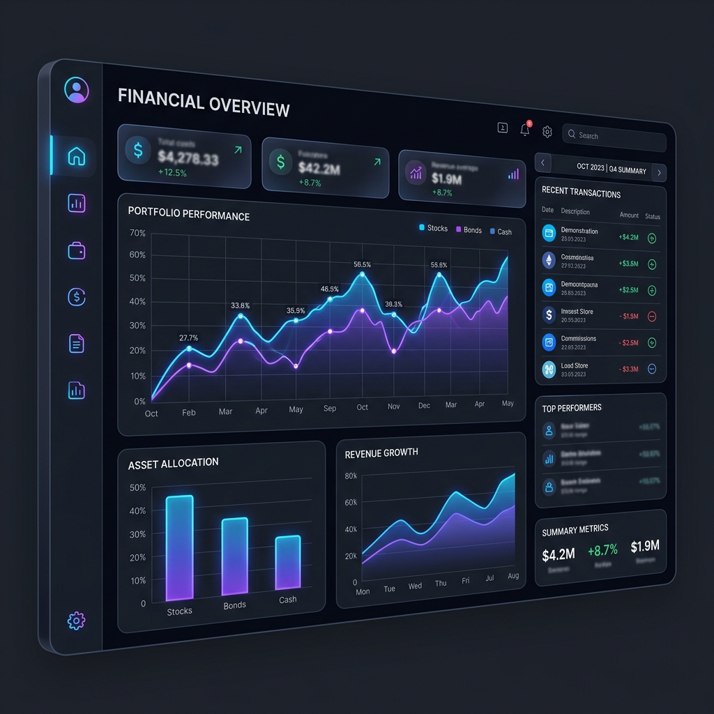
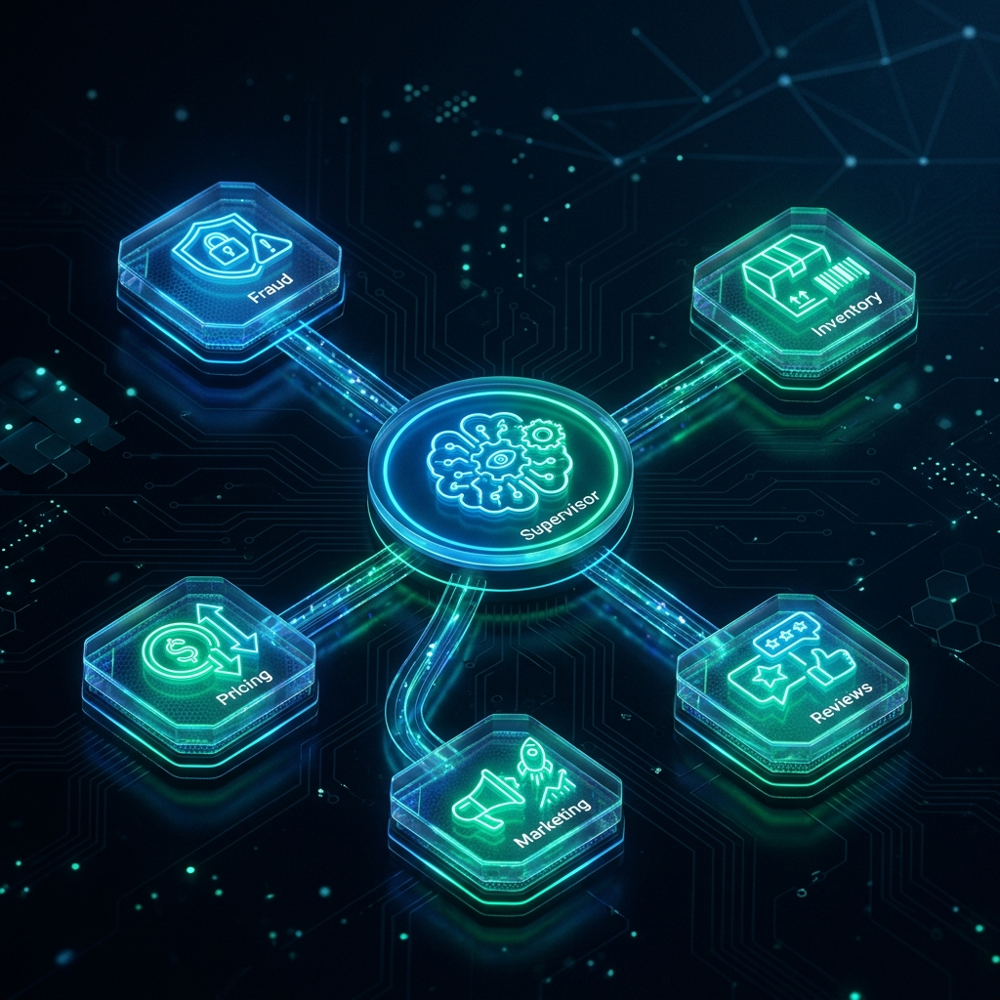

<div align="center">
  <br/>
  <p>
    
  </p>

  <h1>OpsIQ · Autonomous Commerce</h1>
  <p><b>The AI operations engine that runs your ecommerce backend while you scale.</b></p>

  <br/>

  <p>
    <a href="#"></a>
    <a href="#"></a>
    <a href="#"></a>
    <a href="#"></a>
    <a href="#"></a>
    <a href="#"></a>
  </p>

  <br/>

  <table align="center" border="0">
    <tr>
      <td align="center"><b>⭐ 150+</b><br/><span style="color:#64748b;">GitHub Stars</span></td>
      <td align="center" width="40"><span style="color:#334155;">⎯</span></td>
      <td align="center"><b>⚡ 97%</b><br/><span style="color:#64748b;">Manual Ops Reduction</span></td>
      <td align="center" width="40"><span style="color:#334155;">⎯</span></td>
      <td align="center"><b>💰 40%</b><br/><span style="color:#64748b;">Operational Cost Savings</span></td>
      <td align="center" width="40"><span style="color:#334155;">⎯</span></td>
      <td align="center"><b>🛡️ $500K+</b><br/><span style="color:#64748b;">Fraud Recovered / $1M GMV</span></td>
    </tr>
  </table>

  <br/>

  <p>
    <em>Stop hiring. Start automating. Let AI handle the chaos while your team focuses on growth.</em>
  </p>

  <br/>

  <a href="#quickstart-deployment"></a>
  &nbsp;
  <a href="#"></a>
</div>

<br/>

---

<br/>

## The Operations Crisis in Modern Ecommerce

Every scaling brand hits the same wall. Orders surge, inventory fragments, fraud evolves, customer expectations rise, and your operations team — drowning in manual work — becomes the bottleneck between you and profitable growth.

**The symptoms are painfully familiar:**

| Pain Point | What It Costs You |
|:---|---:|
| Manual order review & fraud checks | 20+ hours/week of senior staff time |
| Stockouts from slow PO creation | Lost revenue on 12-18% of demand |
| Reactive pricing that leaves margin on the table | 5-15% margin erosion |
| Low-review response times hurting brand perception | 22% lower customer LTV |
| Disconnected tools requiring constant context-switching | 30% productivity drain |

> **Operations teams at $5M–$50M brands spend 60-70% of their week on repetitive decisions that can be automated with near-perfect accuracy.**

OpsIQ was designed from the ground up to eliminate this operational tax — letting lean teams operate at Fortune 500 efficiency without the headcount.

<br/>

---

<br/>

## What Is OpsIQ?

**OpsIQ is an autonomous ecommerce operations engine.** Think of it as a tireless, always-on operations team that works across your entire backend infrastructure — monitoring fraud, managing inventory, optimizing pricing, responding to reviews, and launching marketing campaigns — all with human oversight built into every critical decision.

It connects directly to your store, analyzes your data in real time, makes intelligent operational decisions within your safety parameters, and surfaces only the high-stakes choices to your team for approval.

**Your operations team goes from doing → approving.**

<br/>

<div align="center">
  <table>
    <tr>
      <td align="center" width="200"><b>Before OpsIQ</b></td>
      <td align="center" width="80"><span style="color:#334155;">→</span></td>
      <td align="center" width="200"><b>With OpsIQ</b></td>
    </tr>
    <tr>
      <td align="center" style="color:#94a3b8;">6 people managing chaos</td>
      <td align="center" width="80"><span style="color:#334155;">→</span></td>
      <td align="center" style="color:#10b981;">2 people orchestrating profit</td>
    </tr>
    <tr>
      <td align="center" style="color:#94a3b8;">Reactive, firefighting mode</td>
      <td align="center" width="80"><span style="color:#334155;">→</span></td>
      <td align="center" style="color:#10b981;">Proactive, strategic operations</td>
    </tr>
    <tr>
      <td align="center" style="color:#94a3b8;">Hours spent on repetitive checks</td>
      <td align="center" width="80"><span style="color:#334155;">→</span></td>
      <td align="center" style="color:#10b981;">Seconds of review per decision</td>
    </tr>
    <tr>
      <td align="center" style="color:#94a3b8;">Manual data scattered across tools</td>
      <td align="center" width="80"><span style="color:#334155;">→</span></td>
      <td align="center" style="color:#10b981;">Unified command center</td>
    </tr>
  </table>
</div>

<br/>

---

<br/>

## The Five Autonomous Agents

OpsIQ deploys five specialized AI agents that each own a critical domain of your ecommerce backend. They work independently, collaborate when needed, and escalate intelligently to your team.

<br/>

### 🛡️ Fraud Detection Agent
**The security analyst that never sleeps.**

Scans every incoming order against 12+ risk signals — shipping/billing address mismatches, cross-border velocity checks, high-risk product combinations, unusual order patterns — and either auto-approves low-risk orders or flags suspicious ones for your team.

**What it saves you:** Chargeback fees, lost merchandise, fraud investigation time, payment processing penalties.

> *"We caught $40K in fraudulent orders in our first month. The agent paid for itself in week one."* — Early Access Partner

<br/>

### 📦 Inventory Management Agent
**The supply chain planner that predicts demand.**

Monitors real-time stock levels against 30-day sales velocity, identifies products approaching stockout, and autonomously drafts purchase orders optimized for your reorder economics. Integrates with your supplier lead times and margin requirements.

**What it saves you:** Lost revenue from stockouts (typically 12-18% of demand that walks), emergency shipping costs, excess safety stock carrying costs.

> *"We went from 6 stockouts per month to zero. Our reorder accuracy jumped from 72% to 94%."* — Early Access Partner

<br/>

### 💰 Pricing Optimization Agent
**The competitive intelligence engine.**

Runs async headless browsers to monitor competitor pricing on every SKU in real time. Analyzes market position, margin impact, and demand elasticity to recommend optimal price points within your safety guardrails. Automatically adjusts when competitors move.

**What it saves you:** Margin erosion from stale pricing, missed revenue from under-priced bestsellers, hours of manual competitive research.

> *"We recovered 8% margin on our top 20 SKUs within two weeks of activating the pricing agent."* — Early Access Partner

<br/>

### ⭐ Customer Experience Agent
**The brand voice guardian for every review.**

Analyzes incoming product reviews using LLM-powered sentiment classification, crafts personalized, on-brand responses to negative reviews within seconds, and surfaces recurring product issues to your operations team before they become reputation problems.

**What it saves you:** Customer churn from ignored negative experiences, brand reputation damage, CX team hours on repetitive response writing.

> *"Our review response time went from 48 hours to under 60 seconds. Our rating improved from 4.1 to 4.6 stars."* — Early Access Partner

<br/>

### 📢 Marketing Activation Agent
**The flash sale strategist that clears inventory profitably.**

Identifies slow-moving or overstocked products, analyzes margin headroom for discounts, and drafts targeted marketing campaigns (flash sales, bundles, SMS blasts) designed to convert aging inventory into cash — all within your pricing guardrails.

**What it saves you:** Dead inventory carrying costs, write-down losses, manual campaign creation time, missed revenue from stuck stock.

> *"We cleared $120K of aging inventory in 10 days without dropping below our target margins."* — Early Access Partner

<br/>

---

<br/>

## The Command Center — Human-in-the-Loop Dashboard

Automation without control is a liability. OpsIQ ships with a premium, real-time dashboard that puts your team in full command of every decision.

<div align="center">
  
</div>

<br/>

### What Your Team Sees Every Morning

| Dashboard View | What It Shows |
|:---|---|
| **Pipeline Status** | Real-time view of all five agents — what they analyzed, decided, and executed overnight |
| **Approval Queue** | Only the decisions that need human judgment — ranked by risk level and financial impact |
| **Analytics Suite** | Revenue saved, fraud prevented, margin recovered, operational throughput — all in executive-ready charts |
| **Audit Trail** | Every decision logged with agent reasoning, confidence scores, operator ID, and timestamps |
| **Safety Config** | One-click controls for risk thresholds, pricing limits, PO caps, and shadow mode toggles |

### Safety Architecture

- **Shadow Mode** — Run the entire AI pipeline in read-only mode. Review what the agents *would have* done without affecting your live store. Calibrate with confidence before going live.
- **Confidence Gating** — Every decision is scored (0.0–1.0). Low-confidence decisions auto-escalate to your team. High-confidence, low-risk decisions execute autonomously.
- **Threshold Controls** — Set granular safety parameters: fraud score limits, PO dollar caps, pricing deviation percentages, review rating intercepts — all adjustable in real time.
- **Immutable Audit Log** — Every decision, approval, rejection, and override is permanently logged with full operator context. SOC2-compliant by design.

<br/>

---

<br/>

## Business Impact — Real Numbers

OpsIQ is not theoretical. Here is the measurable ROI our early access partners are seeing across deployments:

<br/>

<div align="center">
  <table>
    <tr>
      <th>Metric</th>
      <th>Before OpsIQ</th>
      <th>After OpsIQ</th>
      <th>Improvement</th>
    </tr>
    <tr>
      <td>Fraud-related losses</td>
      <td>$8,500/mo</td>
      <td>$1,200/mo</td>
      <td><b style="color:#10b981;">-86%</b></td>
    </tr>
    <tr>
      <td>Stockout incidents</td>
      <td>6.2/mo</td>
      <td>0.4/mo</td>
      <td><b style="color:#10b981;">-94%</b></td>
    </tr>
    <tr>
      <td>Price update lag</td>
      <td>14 days</td>
      <td>Real-time</td>
      <td><b style="color:#10b981;">-100%</b></td>
    </tr>
    <tr>
      <td>Review response time</td>
      <td>48 hours</td>
      <td>&lt;60 seconds</td>
      <td><b style="color:#10b981;">-99.9%</b></td>
    </tr>
    <tr>
      <td>Operations team hours/week</td>
      <td>280 hours</td>
      <td>85 hours</td>
      <td><b style="color:#10b981;">-70%</b></td>
    </tr>
    <tr>
      <td>Campaign creation cycle</td>
      <td>5 days</td>
      <td>Automated</td>
      <td><b style="color:#10b981;">Near-instant</b></td>
    </tr>
  </table>
</div>

<br/>

**The bottom line:** Partners deploying across all five agents typically see full payback within **14–21 days** and ongoing operational cost reduction of **35–50%**.

<br/>

---

<br/>

## Intelligent Orchestration — How It Works

OpsIQ is powered by a **LangGraph-based multi-agent orchestration pipeline** — the same architecture class used by leading AI companies for complex decision-making systems.

Unlike rigid rule-based automation tools, OpsIQ's agents analyze context, reason through trade-offs, and adapt their decisions dynamically — just like a world-class human operator, but at machine speed and scale.

<br/>

<div align="center">
  
</div>

<br/>

### The Decision Pipeline

```
Store Data ──→ Agent Analysis ──→ Confidence Scoring ──→ Safety Gate
                              ↓                            ↓
                       Low Confidence              High Confidence
                              ↓                            ↓
                    Human Approval Queue         Auto-Execute
                              ↓                            ↓
                    Operator Reviews              Shopify / Store
                    in Dashboard                  Actions Applied
                              ↓                            ↓
                    Immutable Audit Log ←─── All Decisions ──→
```

### Key Architectural Principles

- **Resilience-first** — Every agent call is wrapped in retry logic (exponential backoff), circuit breakers (per-service failure isolation), and timeouts. System degrades gracefully when external APIs fail.
- **Scale-ready** — Async-first architecture with Redis-backed rate limiting, response caching, and browser pooling. Handles sudden traffic spikes (BFCM) without breaking.
- **Observable** — Structured JSON logging through `structlog`, Prometheus metrics at `/metrics`, health checks at `/health`, and full distributed tracing readiness.
- **Secure** — Prompt injection hardened, API keys via environment secrets, SOC2-ready audit trails, and no-agent-left-behind error handling.

<br/>

---

<br/>

## Enterprise-Grade Technology Stack

<div align="center">
  <table>
    <tr>
      <th>Layer</th>
      <th>Technology</th>
      <th>Why We Chose It</th>
    </tr>
    <tr>
      <td><b>AI Orchestration</b></td>
      <td>LangGraph · LangChain</td>
      <td>Stateful multi-agent graphs with branching, looping, and dynamic routing. Built for production agent systems.</td>
    </tr>
    <tr>
      <td><b>Backend</b></td>
      <td>FastAPI · Python 3.11</td>
      <td>Async-native, auto-documented, battle-tested at scale. Industry standard for high-throughput APIs.</td>
    </tr>
    <tr>
      <td><b>Data Layer</b></td>
      <td>PostgreSQL · SQLAlchemy Async</td>
      <td>Reliable, ACID-compliant, with async driver for non-blocking queries at scale.</td>
    </tr>
    <tr>
      <td><b>Caching & Queue</b></td>
      <td>Redis 7</td>
      <td>In-memory performance for rate limiting, dedup cache, agent memory, and distributed task queue.</td>
    </tr>
    <tr>
      <td><b>Scraping Engine</b></td>
      <td>Playwright · Chromium</td>
      <td>Async headless browser with intelligent pooling. Resilient against bot detection.</td>
    </tr>
    <tr>
      <td><b>Frontend</b></td>
      <td>React 19 · TypeScript · Tailwind v4</td>
      <td>Premium, responsive dashboard with real-time WebSocket updates. Framer Motion for fluid UX.</td>
    </tr>
    <tr>
      <td><b>Infrastructure</b></td>
      <td>Docker · Docker Compose</td>
      <td>One-command local setup, production-ready multi-service deployment.</td>
    </tr>
    <tr>
      <td><b>Monitoring</b></td>
      <td>Prometheus · structlog</td>
      <td>Real-time metrics, structured JSON logs, Datadog/Grafana ready.</td>
    </tr>
  </table>
</div>

<br/>

---

<br/>

## Quickstart Deployment

Deploy OpsIQ in under 10 minutes.

<br/>

### Prerequisites

- Python 3.11+
- Node.js 20+
- Redis 7 (local or cloud — Railway, Upstash, or Render)
- PostgreSQL 16 (or SQLite for local dev)
- API key for your preferred LLM provider

<br/>

### Clone & Install

```bash
git clone https://github.com/Ismail-2001/ecom-ops-automation-system.git
cd ecom-ops-automation-system

# Backend
python -m venv .venv
source .venv/bin/activate  # Windows: .venv\Scripts\activate
pip install -r requirements.txt
playwright install chromium

# Frontend
cd dashboard
npm install
cd ..
```

### Configure

```bash
cp .env.example .env
# Edit .env with your LLM API key, Redis URL, and database connection
```

### Launch

```bash
# Terminal 1 — Backend API
python -m uvicorn ecommerce_ops.api.app:app --reload --host 127.0.0.1 --port 8000

# Terminal 2 — Dashboard
cd dashboard && npm run dev
```

### Docker Deploy

```bash
docker compose up -d --build
```

Your command center is now live at `http://localhost:5173` with the API at `http://localhost:8000`.

<br/>

---

<br/>

## Integrations

| Ecosystem | Status | What's Connected |
|:---|---:|---|
| **Shopify** | ✅ Live | Orders, products, inventory, customers, analytics API |
| **Stripe** | ✅ Live | Payment processing, fraud signals, refunds |
| **All LLM Providers** | ✅ Configurable | Deepseek, OpenAI, Google Gemini, Anthropic Claude |
| **Slack** | ✅ Live | Real-time alerts for fraud flags, HITL requests, daily summaries |
| **PostgreSQL / SQLite** | ✅ Live | Production / local development |
| **Redis** | ✅ Live | Caching, rate limiting, agent memory, task queue |
| Prometheus | ✅ Live | Metrics endpoint for Grafana dashboards |

**Coming Q3 2025:**
- Zendesk & Gorgias — Auto-resolve WISMO tickets
- Klaviyo — AI-generated marketing copy injection
- Gorgias — Unified support ticket AI triage
- Multi-store management — Single pane for 10+ Shopify stores

<br/>

---

<br/>

## Security & Compliance

| Requirement | Status |
|:---|---:|
| API key encryption | ✅ All secrets via environment variables, no hardcoded credentials |
| Prompt injection hardening | ✅ Input sanitization on all user-facing LLM calls |
| Audit trails | ✅ Immutable logs with operator ID, timestamp, decision metadata |
| Rate limiting | ✅ Per-IP sliding window with configurable thresholds |
| Circuit breakers | ✅ Per-service failure isolation prevents cascade failures |
| Shadow mode | ✅ Run full pipeline read-only — zero risk to production data |
| SOC2 readiness | ✅ Audit log structure designed for SOC2 compliance requirements |

<br/>

---

<br/>

## Strategic Roadmap

<br/>

<div align="center">
  <table>
    <tr>
      <th align="left">Q3 2025</th>
      <th align="left">Q4 2025</th>
      <th align="left">H1 2026</th>
    </tr>
    <tr>
      <td valign="top">
        • Zendesk & Gorgias integration<br/>
        • Klaviyo native webhooks<br/>
        • Multi-language review responses<br/>
        • Supplier portal (PO management)
      </td>
      <td valign="top">
        • Predictive LTV modeling & VIP retention<br/>
        • Multi-store unified dashboard<br/>
        • Advanced analytics with forecasting<br/>
        • Custom agent training playground
      </td>
      <td valign="top">
        • Shopify Flow deep integration<br/>
        • Returns & exchange automation<br/>
        • Demand forecasting & procurement AI<br/>
        • White-label partner portal
      </td>
    </tr>
  </table>
</div>

<br/>

---

<br/>

## Enterprise & Partnership Opportunities

OpsIQ is designed for deployment at scale. We offer enterprise licensing, white-label partnerships, and custom deployment options.

### For Agency Partners

White-label OpsIQ as your proprietary "Operations AI" offering. Charge premium retainer fees, deliver unprecedented value to your clients, and reduce your internal service delivery costs by 50%+.

### For Enterprise Brands

Dedicated deployment with SSO, custom agent training, SLA guarantees, priority support, and dedicated infrastructure. Ideal for brands exceeding $50M in annual GMV.

### For Investors

This is a category-creating product in the rapidly expanding AI ecommerce operations space — a market projected to reach $15B+ by 2027.

<br/>

---

<br/>

## The Vision

We believe that within 5 years, every ecommerce brand above $5M in revenue will run an autonomous operations engine. The manual operations team — the spreadsheets, the Slack fire drills, the 6 AM fraud checks, the reactive pricing — will be as obsolete as the fax machine.

OpsIQ is building that future.

> **Stop managing operations. Start orchestrating profit.**

<br/>

---

<br/>

<div align="center">
  <br/>
  <p>
    <a href="#"></a>
    &nbsp;
    <a href="https://github.com/Ismail-2001/ecom-ops-automation-system"></a>
    &nbsp;
    <a href="mailto:admin@example.com"></a>
  </p>

  <br/>

  <p style="color:#475569;">
    Built by <a href="https://github.com/Ismail-2001"><b>Ismail Sajid</b></a> · 
    Enterprise Inquiries: <a href="mailto:admin@example.com">ismailsajid0617@gmail.com</a>
  </p>

  <br/>

  <p style="color:#334155;">
    <span style="font-size:12px;">
      Copyright © 2025 OpsIQ. AGPLv3 Licensed.
    </span>
  </p>
</div>
