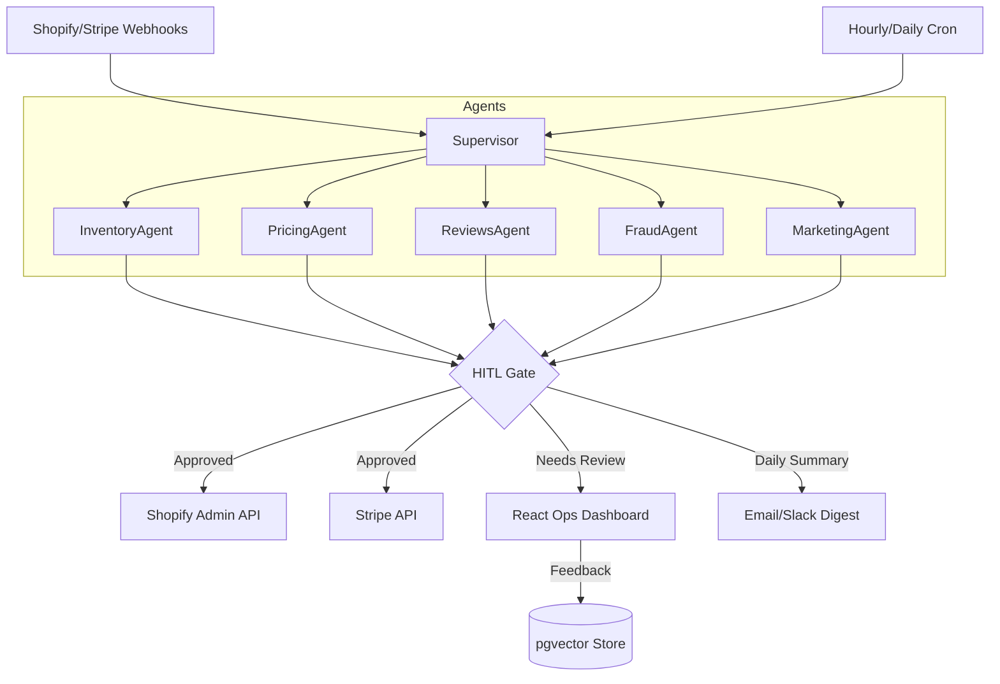

# 🤖 ecommerce-ops-agent

The autonomous ops brain for your Shopify store. 

`ecommerce-ops-agent` is a production-grade multi-agent system built on LangGraph that runs your store's day-to-day operations—inventory management, dynamic pricing, review response, fraud detection, and marketing drafts—so you can focus on building your brand.

---

## 🏛 Architecture



---

## 🛡 Safety Model: Trust is Earned

Nothing is autonomous on day one. We follow a **Shadow-to-Autonomy graduation path**:

1.  **Shadow Mode (Default)**: The agent proposes actions. You approve or reject them in the dashboard or via the daily digest. 
2.  **Learning Loop**: Every approval builds the agent's confidence. Every rejection is a training signal stored in `pgvector`.
3.  **Graduation**: An agent only becomes autonomous for a specific action type (e.g., "5-star review response") after **50 consecutive approvals** with >95% agreement.
4.  **Hard Caps**: Even when autonomous, any action breaching your hard caps (e.g., PO > $1,000 or Price Change > 20%) is automatically routed to the Human-in-the-Loop (HITL) gate.

---

## 🚀 Quickstart

### Prerequisites
- Docker & Docker Compose
- Shopify Admin API Credentials
- DeepSeek API Key (Exclusive LLM provider)

### Run with Docker
```bash
git clone https://github.com/Syedhuzaifa519/ecommerce-ops-agent.git
cd ecommerce-ops-agent
cp .env.example .env # Add your keys here
docker compose up -d
```

### Run in Shadow Mode
```bash
ops-agent run --shadow
```

---

## 📦 What's Inside?

| Agent | Responsibility | Autonomy Level |
| :--- | :--- | :--- |
| **Inventory** | Stockout prediction, PO drafting, Dead stock detection | HITL for POs > $X |
| **Pricing** | Competitor-aware dynamic pricing within bands | Autonomous within ±5% |
| **Reviews** | Sentiment analysis & personalized responses | Autonomous for 4-5 stars |
| **Fraud** | Real-time risk scoring & order holds | Autonomous for high-risk holds |
| **Marketing** | Bundle analysis & recovery campaign drafts | Always Draft-only |

---

## ⚖️ Comparison

| Feature | ecommerce-ops-agent | $60k/yr Ops Coordinator |
| :--- | :--- | :--- |
| **Response Time** | < 1 minute | 2-4 hours |
| **Availability** | 24/7/365 | Mon-Fri, 9-5 |
| **Reasoning** | DeepSeek (LLM) | Human Experience |
| **Data Processing** | Millions of SKUs/s | Manual Checklists |
| **Cost** | ~$50/mo (LLM) | $5,000/mo |

---

## 📄 License
Open Source under MIT License.
