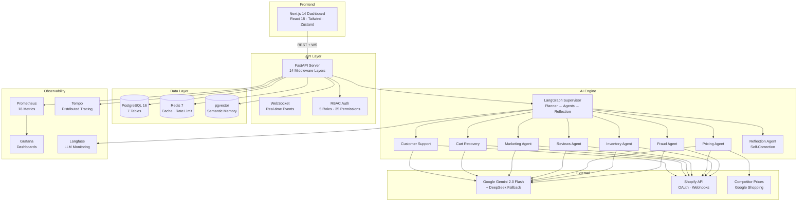
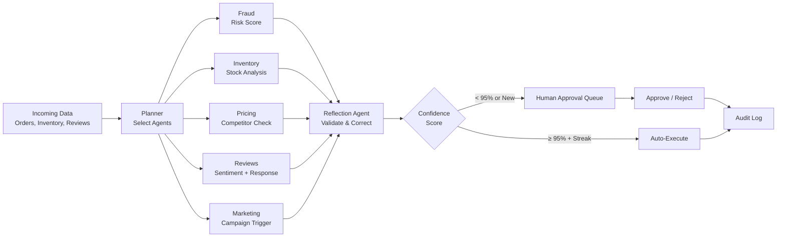
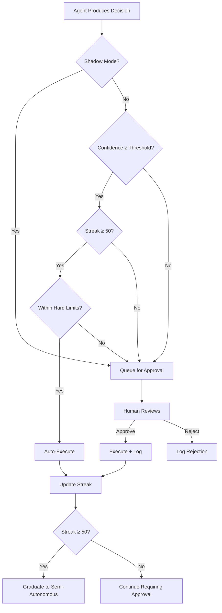

<div align="center">

# OpsIQ

### The AI operations team for online stores that never sleeps, never forgets, and always shows its work.

[](LICENSE)
[](https://python.org)
[](https://nextjs.org)
[](https://fastapi.tiangolo.com)
[](https://langchain-ai.github.io/langgraph)
[](https://docker.com)
[](.github/workflows)
[](AUDIT_REPORT.md)

**7 AI Agents. 1 Dashboard. Human-in-the-loop by default.**

[Getting Started](#-getting-started) · [Architecture](#-architecture) · [API Docs](#-usage-examples) · [Deploy](#-docker-production) · [Live Demo](#-live-demo)

</div>

---

## The Problem

Every growing e-commerce brand hits the same wall. Orders are pouring in, but so is the busywork behind them: checking whether a suspicious order is fraud, deciding when to reorder stock before it runs out, adjusting prices when a competitor moves, replying to the fiftieth "where is my order" message of the day, and chasing the shoppers who filled a cart and left.

None of this is complicated work. It's just **constant**. And it's exactly the kind of work that either gets done late, gets done inconsistently, or gets done by hiring more people — which is expensive, slow, and doesn't scale evenly with the business.

| Pain Point | Business Impact |
|:-----------|:----------------|
| Manual fraud review | Chargebacks eat 1-3% of revenue |
| Reactive inventory management | Stockouts lose 4-8% of potential sales |
| Static pricing | Competitors undercut you while you're unaware |
| Slow review responses | Negative reviews compound, trust erodes |
| Ignored abandoned carts | 70% of carts are abandoned, 0% recovered without action |
| Hiring support staff | $35K-50K/year per rep, doesn't scale with demand |

---

## What OpsIQ Does

OpsIQ is a team of **7 specialized AI agents** that sits behind the scenes of a store and handles this operational load continuously — the way a sharp operations team would, if that team never took a break.

<div align="center">

| Agent | What It Handles | Business Outcome |
|:------|:----------------|:-----------------|
| **Fraud Detection** | Risk-scores every order (0-100), flags suspicious patterns | Prevent chargebacks before they ship |
| **Inventory Management** | Forecasts demand, drafts purchase orders, tracks stockout risk | Never run out of bestsellers |
| **Price Optimization** | Scrapes competitor prices, enforces floor/ceiling margins | Stay competitive without margin erosion |
| **Review Moderation** | Analyzes sentiment, drafts responses in your brand voice | Build trust at any review volume |
| **Marketing Automation** | Triggers campaigns based on real store events (low stock, trends) | Convert at the right moment |
| **Cart Recovery** | Scores abandoned carts, selects recovery strategy (discount, urgency, email series) | Recover 8-12% of lost revenue |
| **Customer Support** | Classifies tickets, routes correctly, answers routine questions | Handle 60-80% of tickets with AI |

</div>

---

## How It Thinks — In Plain Terms

The honest concern most business owners have about "AI running my store" is simple: *what happens when it's wrong?*

OpsIQ is built around answering that question first, before anything else:

- **Nothing acts on its own by default.** Every new setup starts in a mode where the AI proposes an action and a human approves it — the system earns autonomy over time, it isn't handed it on day one.
- **There are hard limits it cannot cross.** Spending caps, price-change limits, and confidence thresholds are set by the business owner, not the AI. If a decision falls outside those limits or the AI isn't confident, it stops and asks a person.
- **Every decision leaves a paper trail.** Nothing happens silently. Every action the system takes — and every reason behind it — is logged and reviewable, the same way you'd expect a good employee to be able to explain their own decisions.

This matters more than any feature list. A system that automates the wrong decision quickly is worse than no automation at all. OpsIQ is designed to be **trusted gradually, not blindly**.

---

## Key Features

### AI & Automation

- **7 Specialized Agents** — Each agent is domain-expert in its area (fraud, inventory, pricing, reviews, marketing, cart recovery, support) with dedicated logic, guardrails, and decision formats
- **LangGraph Supervisor Orchestration** — Agents run in a defined pipeline with a planner that dynamically selects which agents execute based on available data, plus a reflection agent that self-corrects decisions post-execution
- **LLM-First with Rule-Based Fallback** — Each agent tries Google Gemini 2.0 Flash (or DeepSeek) for rich analysis, then silently falls back to deterministic rules on any LLM failure — zero downtime, zero data loss
- **Semantic LLM Cache** — Cosine-similarity cache (threshold 0.92) with bounded 200-entry index eliminates redundant LLM calls for similar queries, with graceful degradation on import failure
- **Inter-Agent Communication** — Built-in message bus with 18 predefined topics (fraud.alert, inventory.low, cart.abandoned, etc.) enables agents to coordinate without tight coupling
- **Cost Tracking** — Per-agent LLM token usage and cost monitoring with Prometheus metrics and configurable daily budgets

### Human-in-the-Loop

- **Shadow Mode by Default** — Every decision requires human approval until the agent earns autonomy through a streak-based graduation system (50+ consecutive high-confidence approvals)
- **Approval Queue** — SQL-side search (PostgreSQL `LIKE` on id/payload/evidence), filterable queue with risk-level badges, confidence scores, and one-click approve/reject/batch operations
- **Hard Safety Limits** — Configurable PO limits ($1,000 default), price-change caps (20%), and confidence thresholds that the AI cannot override
- **Reflection Agent** — Post-pipeline self-review that validates all decisions, corrects confidence scores, and enforces HITL consistency

### Security & Compliance

- **5-Role RBAC** — super_admin, admin, operator, viewer, api_only with 35 granular permissions across 12 categories
- **PBKDF2 API Key Management** — SHA-256 hashed keys with `eops_` prefix, 90-day expiry, usage tracking (Phase 1 hardening)
- **Comprehensive Audit Logging** — Every action, decision, and security event logged to PostgreSQL with risk-level assessment and sensitive-field redaction
- **Rate Limiting** — Redis sliding window (60 req/min) with LRU-eviction in-memory fallback, per-IP tracking, and automatic blocking
- **Security Hardening** — HSTS, CSP, X-Frame-Options: DENY, input sanitization (25+ injection patterns), SQL/XSS blocking, no hardcoded secrets
- **Webhook HMAC Verification** — Shopify webhooks validated with HMAC signature (Phase 1)
- **Session Secret Rotation** — Cryptographically random session secrets, rotated on deploy (Phase 1)

### Observability

- **21 Prometheus Metrics** — Request rates, agent decisions, LLM costs, queue depths, financial impact, cache ratios, LLM cache hits/misses, DB connection pool
- **14 Alert Rules** — API errors, latency spikes, agent failures, Redis/PostgreSQL down, LLM budget exceeded, missing backups
- **OpenTelemetry Tracing** — Distributed traces via OTLP to Grafana Tempo with 10% sampling
- **Langfuse Integration** — LLM-specific observability: traces, evaluations, cost breakdowns per model
- **Grafana Dashboards** — Pre-configured dashboards for API, agents, infrastructure, and LLM costs

### Infrastructure

- **13-Service Docker Stack** — PostgreSQL, Redis, API, Dashboard, Nginx, Prometheus, Grafana, Tempo, OTEL Collector, Alertmanager, exporters
- **Multi-Stage Docker Build** — Python 3.12-slim with Playwright (Chromium + Firefox + WebKit), non-root user, uvloop+httptools, 2 workers
- **Rolling Deploy** — Zero-downtime deployment with auto-rollback on health check failure (`./scripts/deploy.sh rolling`)
- **Offsite Backup** — Automated PostgreSQL dumps with S3/GCS upload (STANDARD_IA), 7-day retention
- **CI/CD Pipeline** — 7 GitHub Actions workflows: lint+mypy, test, security scan, Docker build, Trivy scan, staging deploy, production deploy with auto-rollback
- **Database Migrations** — Alembic with drift detection in CI
- **Disaster Recovery** — Defined RTO/RPO targets, recovery procedures, escalation contacts (`docs/DR_POLICY.md`)
- **Kubernetes-Ready** — `/health`, `/ready`, `/live` endpoints for orchestration

---

## Live Demo

### Command Center Dashboard


*Real-time operations overview with revenue tracking, decision queue, and system health.*

### 7 Autonomous AI Agents


*Each agent operates independently with accuracy tracking, decision counts, and live sparklines.*

### Inference Logs & Real-Time Decisions


*Every agent action logged with timestamps, results, and latency metrics.*

### Performance Analytics


*428% ROI, $1.24M revenue saved, 82% autonomous decisions, real-time risk distribution across regions.*

---

## Architecture

### System Overview


```mermaid
graph TB
    subgraph "Frontend"
        UI["Next.js 14 Dashboard<br/>React 18 · Tailwind · Zustand"]
    end

    subgraph "API Layer"
        API["FastAPI Server<br/>14 Middleware Layers"]
        WS["WebSocket<br/>Real-time Events"]
        AUTH["RBAC Auth<br/>5 Roles · 35 Permissions"]
    end

    subgraph "AI Engine"
        SUP["LangGraph Supervisor<br/>Planner → Agents → Reflection"]
        FRAUD["Fraud Agent"]
        INV["Inventory Agent"]
        PRICE["Pricing Agent"]
        REV["Reviews Agent"]
        MKT["Marketing Agent"]
        CART["Cart Recovery"]
        CS["Customer Support"]
        REFLECT["Reflection Agent<br/>Self-Correction"]
    end

    subgraph "External"
        LLM["Google Gemini 2.0 Flash<br/>+ DeepSeek Fallback"]
        SHOPIFY["Shopify API<br/>OAuth · Webhooks"]
        WEB["Competitor Prices<br/>Google Shopping"]
    end

    subgraph "Data Layer"
        PG[("PostgreSQL 16<br/>7 Tables")]
        REDIS[("Redis 7<br/>Cache · Rate Limit")]
        PGV[("pgvector<br/>Semantic Memory")]
    end

    subgraph "Observability"
        PROM["Prometheus<br/>18 Metrics"]
        GRAF["Grafana<br/>Dashboards"]
        TEMPO["Tempo<br/>Distributed Tracing"]
        LANGFUSE["Langfuse<br/>LLM Monitoring"]
    end

    UI -->|REST + WS| API
    API --> AUTH
    API --> SUP
    SUP --> FRAUD & INV & PRICE & REV & MKT & CART & CS
    SUP --> REFLECT
    FRAUD & INV & PRICE & REV & MKT & CART & CS --> LLM
    FRAUD & INV & PRICE & REV & MKT & CART & CS --> SHOPIFY
    PRICE --> WEB
    API --> PG & REDIS & PGV
    API --> PROM
    PROM --> GRAF
    API --> TEMPO
    SUP --> LANGFUSE
```

### Agent Pipeline Flow


```mermaid
graph LR
    A[Incoming Data<br/>Orders, Inventory, Reviews] --> B[Planner<br/>Select Agents]
    B --> C[Fraud<br/>Risk Score]
    B --> D[Inventory<br/>Stock Analysis]
    B --> E[Pricing<br/>Competitor Check]
    B --> F[Reviews<br/>Sentiment + Response]
    B --> G[Marketing<br/>Campaign Trigger]
    C --> H[Reflection Agent<br/>Validate & Correct]
    D --> H
    E --> H
    F --> H
    G --> H
    H --> I{Confidence<br/>Score}
    I -->|≥ 95% + Streak| J[Auto-Execute]
    I -->|< 95% or New| K[Human Approval Queue]
    K --> L[Approve / Reject]
    L --> M[Audit Log]
    J --> M
```

### Human-in-the-Loop Decision Flow


```mermaid
graph TD
    A[Agent Produces Decision] --> B{Shadow Mode?}
    B -->|Yes| C[Queue for Approval]
    B -->|No| D{Confidence ≥ Threshold?}
    D -->|Yes| E{Streak ≥ 50?}
    D -->|No| C
    E -->|Yes| F{Within Hard Limits?}
    E -->|No| C
    F -->|Yes| G[Auto-Execute]
    F -->|No| C
    C --> H[Human Reviews]
    H -->|Approve| I[Execute + Log]
    H -->|Reject| J[Log Rejection]
    G --> K[Update Streak]
    I --> K
    K --> L{Streak ≥ 50?}
    L -->|Yes| M[Graduate to Semi-Autonomous]
    L -->|No| N[Continue Requiring Approval]
```

---

## Tech Stack

<table>
<tr>
<td><strong>Category</strong></td>
<td><strong>Technology</strong></td>
<td><strong>Purpose</strong></td>
</tr>
<tr>
<td><strong>Backend</strong></td>
<td>Python 3.12, FastAPI, Uvicorn (uvloop + httptools)</td>
<td>Async API server, 2 workers, production-grade HTTP</td>
</tr>
<tr>
<td><strong>AI / LLM</strong></td>
<td>LangGraph, LangChain, Google Gemini 2.0 Flash, DeepSeek</td>
<td>Agent orchestration, LLM inference, tool calling</td>
</tr>
<tr>
<td><strong>Frontend</strong></td>
<td>Next.js 14, React 18, TypeScript, Tailwind CSS</td>
<td>Dashboard with 15+ pages, real-time WebSocket updates</td>
</tr>
<tr>
<td><strong>State Management</strong></td>
<td>Zustand (client), TanStack Query (server)</td>
<td>Global state, server-state caching, optimistic updates</td>
</tr>
<tr>
<td><strong>Database</strong></td>
<td>PostgreSQL 16, SQLAlchemy (async), Alembic, pgvector</td>
<td>7 tables, async connection pooling, migrations, vector memory</td>
</tr>
<tr>
<td><strong>Cache</strong></td>
<td>Redis 7</td>
<td>Rate limiting, session cache, LLM response caching</td>
</tr>
<tr>
<td><strong>E-Commerce</strong></td>
<td>Shopify API (OAuth + Webhooks)</td>
<td>Products, orders, abandoned carts, checkouts</td>
</tr>
<tr>
<td><strong>Scraping</strong></td>
<td>Playwright (Chromium, Firefox, WebKit)</td>
<td>Cross-browser competitor price monitoring via Google Shopping</td>
</tr>
<tr>
<td><strong>Observability</strong></td>
<td>Prometheus, Grafana, Tempo, OpenTelemetry, Langfuse, structlog</td>
<td>Metrics, dashboards, tracing, LLM monitoring</td>
</tr>
<tr>
<td><strong>Testing</strong></td>
<td>pytest, Vitest, Playwright, Locust</td>
<td>30+ test files, load tests, e2e integration</td>
</tr>
<tr>
<td><strong>CI/CD</strong></td>
<td>GitHub Actions (7 workflows), Docker, Trivy</td>
<td>Lint, test, security scan, build, deploy, rollback</td>
</tr>
<tr>
<td><strong>Infrastructure</strong></td>
<td>Docker Compose (13 services), Nginx, PostgreSQL, Redis</td>
<td>Full production stack with monitoring</td>
</tr>
<tr>
<td><strong>Security</strong></td>
<td>RBAC, SHA-256 API keys, Bandit SAST, pip-audit</td>
<td>5 roles, 35 permissions, input sanitization, audit logging</td>
</tr>
</table>

---

## Project Structure

```
ecom-ops-automation-system/
├── ecommerce_ops/              # Python backend
│   ├── api/                    # FastAPI routes, middleware, WebSocket, metrics
│   │   ├── app.py              # Main application (966 lines)
│   │   ├── routes/             # 7 route modules (shopify, cart, support, etc.)
│   │   ├── middleware.py        # 14-layer middleware stack
│   │   ├── ws.py               # WebSocket with auth + rate limiting
│   │   └── metrics.py          # 18 Prometheus metrics
│   ├── agents/                 # 7 AI agents + infrastructure
│   │   ├── _base.py            # Base agent with LLM + memory
│   │   ├── fraud.py / fraud_llm.py
│   │   ├── inventory.py / inventory_llm.py
│   │   ├── pricing.py
│   │   ├── reviews.py
│   │   ├── marketing.py / marketing_llm.py
│   │   ├── cart_recovery/      # Cart recovery agent (standalone package)
│   │   ├── customer_support/   # Customer support agent (standalone package)
│   │   ├── reflection.py       # Post-pipeline self-correction
│   │   ├── message_bus.py      # Inter-agent pub/sub (18 topics)
│   │   └── cost_tracker.py     # LLM cost monitoring
│   ├── graph/                  # LangGraph supervisor + state
│   │   ├── supervisor.py       # Pipeline orchestration
│   │   └── state.py            # TypedDict state definitions
│   ├── connectors/             # Shopify integration + competitor scraper
│   ├── safety/                 # Guardrails (prompt injection, hallucination)
│   ├── security/               # RBAC, auth, audit, hardening, rate limiting
│   ├── memory/                 # Redis cache, agent memory, pgvector store
│   ├── observability/          # Langfuse, OpenTelemetry, evaluation framework
│   ├── infra/                  # Circuit breaker, rate limiter, retry, task queue
│   ├── pipeline/               # Pipeline runner + builder
│   ├── tools/                  # Tool registry + executor
│   ├── models/                 # SQLAlchemy DB models (7 tables)
│   ├── config.py               # Pydantic Settings with env validation
│   └── cli.py                  # Typer CLI (ops-agent run/pause)
├── frontend/                   # Next.js 14 dashboard
│   └── src/app/                # 15+ page routes
├── tests/                      # 7 focused test modules + fixtures + load tests
├── monitoring/                 # Prometheus, Grafana, Tempo, Alertmanager
├── nginx/                      # Reverse proxy + TLS
├── scripts/                    # 19 operational scripts (deploy, backup, rollback, DR)
├── alembic/                    # Database migrations
├── docs/                       # API.md, DEPLOYMENT.md, PERFORMANCE.md, DR_POLICY.md
├── docker-compose.yml          # Production stack (13 services)
├── docker-compose.agents.yml   # Standalone agents orchestration
├── Dockerfile                  # Multi-stage Python build
├── Makefile                    # Common commands
└── pyproject.toml              # Project metadata + tooling config
```

---

## Getting Started

### Prerequisites

- Python 3.11+
- Node.js 18+
- PostgreSQL 16 (or Docker)
- Redis 7 (or Docker)
- Shopify Partner Account (for live data)

### Quick Start with Docker

```bash
# Clone the repository
git clone https://github.com/Ismail-2001/ecom-ops-automation-system.git
cd ecom-ops-automation-system

# Copy environment template
cp .env.example .env

# Edit .env with your keys (at minimum: API_KEY, GOOGLE_API_KEY)
nano .env

# Start everything (13 services)
docker compose up -d

# Verify
curl http://localhost:8000/health
```

The dashboard is available at `http://localhost:3000` and the API at `http://localhost:8000/docs`.

### Local Development

```bash
# Backend
python -m venv .venv
source .venv/bin/activate  # Windows: .venv\Scripts\activate
pip install -r requirements.txt

# Start PostgreSQL and Redis (or use Docker)
docker compose up -d postgres redis

# Run migrations
alembic upgrade head

# Start the API
uvicorn ecommerce_ops.api.app:app --reload --port 8000

# Frontend (separate terminal)
cd frontend
npm install
npm run dev
```

### Environment Variables

| Variable | Required | Default | Description |
|:---------|:---------|:--------|:------------|
| `API_KEY` | Yes | — | Main API authentication key |
| `GOOGLE_API_KEY` | Yes* | — | Google Gemini API key for LLM |
| `DEEPSEEK_API_KEY` | No | — | Alternative LLM provider |
| `DATABASE_URL` | Yes | `sqlite+aiosqlite:///./ecommerce_ops.db` | PostgreSQL connection string |
| `REDIS_URL` | No | `redis://localhost:6379/0` | Redis connection string |
| `SHOPIFY_API_KEY` | No | — | Shopify OAuth client key |
| `SHOPIFY_PASSWORD` | No | — | Shopify OAuth client secret |
| `SHOPIFY_ACCESS_TOKEN` | No | — | Shopify Admin API token |
| `ENV` | No | `development` | `development`, `production`, or `testing` |
| `SHADOW_MODE` | No | `true` | Require human approval for all decisions |
| `GLOBAL_PO_LIMIT` | No | `1000` | Max purchase order value ($) |
| `GLOBAL_PRICE_CHANGE_LIMIT_PERCENT` | No | `20` | Max price change (%) |

*At least one LLM key (Google or DeepSeek) is required.

---

## Usage Examples

### Health Check

```bash
curl http://localhost:8000/health
```

```json
{
  "status": "healthy",
  "version": "0.2.0",
  "checks": {
    "database": "ok",
    "redis": "ok",
    "agents": "ok",
    "task_queue": "ok"
  }
}
```

### Trigger a Pipeline Run

```bash
curl -X POST http://localhost:8000/api/v1/run \
  -H "X-API-Key: your-api-key" \
  -H "Content-Type: application/json"
```

### List Pending Approvals

```bash
curl http://localhost:8000/api/v1/approvals?status=pending&risk_level=high \
  -H "X-API-Key: your-api-key"
```

### Approve a Decision

```bash
curl -X POST http://localhost:8000/api/v1/approvals/{id}/approve \
  -H "X-API-Key: your-api-key"
```

### Analyze an Abandoned Cart

```bash
curl -X POST http://localhost:8000/cart-recovery/analyze \
  -H "X-API-Key: your-api-key" \
  -H "Content-Type: application/json" \
  -d '{
    "cart_id": "cart-12345",
    "customer_email": "shopper@example.com",
    "items": [{"product_id": "prod-1", "title": "Sneakers", "price": 89.99, "quantity": 1}],
    "total": 89.99
  }'
```

### Create a Support Ticket

```bash
curl -X POST http://localhost:8000/support/tickets \
  -H "X-API-Key: your-api-key" \
  -H "Content-Type: application/json" \
  -d '{
    "ticket_id": "T-1234",
    "customer_email": "customer@example.com",
    "subject": "Where is my order?",
    "body": "I ordered 5 days ago and haven'\''t received any shipping updates."
  }'
```

### Export Audit Logs

```bash
curl "http://localhost:8000/api/v1/audit/export?format=csv&days=30" \
  -H "X-API-Key: your-api-key" \
  -o audit-export.csv
```

### CLI Usage

```bash
# Run the pipeline
ops-agent run

# Pause all agents
ops-agent pause

# Check agent status
ops-agent status
```

---

## Business Benefits

<div align="center">

| Metric | Without OpsIQ | With OpsIQ | Impact |
|:-------|:-------------|:-----------|:-------|
| Fraud Detection | Manual review, 2-4 hour delay | Real-time scoring, <100ms | **60-80% fewer chargebacks** |
| Inventory Management | Weekly manual checks | Continuous monitoring + auto-PO | **4-8% more revenue from stockout prevention** |
| Cart Recovery | 0% recovery rate | 8-12% recovery with multi-strategy | **$800-1,200/month per $10K revenue** |
| Review Response | 24-48 hour response time | Minutes, at any volume | **3x faster trust building** |
| Support Tickets | $35-50K/year per rep | 60-80% AI-handled | **$25-40K annual savings** |
| Price Optimization | Manual competitor checks | Automated daily monitoring | **2-5% margin improvement** |

</div>

### ROI Example

For a store doing **$200K/year** in revenue:

| Category | Annual Savings |
|:---------|:---------------|
| Cart recovery (10% of abandoned carts) | $2,400 - $3,600 |
| Stockout prevention (5% recovery) | $10,000 |
| Support automation (2 reps replaced) | $70,000 - $100,000 |
| Chargeback reduction (60%) | $1,200 - $2,400 |
| **Total Estimated Savings** | **$83,600 - $116,000** |

---

## Security

### Authentication & Authorization

- **API Key Auth**: PBKDF2 hashed keys with `eops_` prefix, 90-day expiry, usage tracking (Phase 1 hardening)
- **5-Role RBAC**: `super_admin` → `admin` → `operator` → `viewer` → `api_only`
- **35 Granular Permissions**: Dashboard, agents, approvals, Shopify, cart recovery, support, observability, memory, settings, users, roles, audit, API keys
- **Permission Dependencies**: `require_auth()`, `require_permission()`, `require_role()`, `require_admin()`
- **Fail-Secure Auth**: Returns 503 on DB errors, never silently proceeds unauthenticated (Phase 2 fix)

### Data Protection

- **Input Sanitization**: Blocks `<script`, `javascript:`, `eval()`, SQL injection, XSS patterns
- **Security Headers**: HSTS, CSP, X-Frame-Options: DENY, X-XSS-Protection, Referrer-Policy
- **Audit Logging**: Every action logged with risk-level assessment and sensitive-field redaction
- **Structured Logging**: stdlib loggers routed through structlog `ProcessorFormatter` — JSON in production, not dead config
- **Rate Limiting**: Redis sliding window (60 req/min) with LRU-eviction in-memory fallback, per-IP blocking

### API Key Rotation

Rotate API keys periodically or on suspected exposure:

1. **Issue a replacement** (the old key stays valid; there is no outage window):
   ```bash
   curl -X POST "$API_URL/security/api-keys/rotate" \
     -H "Authorization: Bearer $ADMIN_TOKEN" \
     -H "Content-Type: application/json" \
     -d '{"key_id": "REPLACE_WITH_KEY_ID"}'
   ```
2. The response contains the **new key exactly once** (`key` field) plus `"previous_key_revoked": true`. Store it securely.
3. Update any downstream consumers that used the old key to the new value.
4. Confirm the old key no longer authenticates; it is immediately deactivated server-side.

- Rotation is atomic: the replacement is created and the old key revoked in the same transaction, so a credential always exists.
- Keys are stored as salted PBKDF2-SHA256 hashes; raw keys are never persisted and can never be re-read after creation. Legacy unsalted SHA-256 hashes from pre-migration rows are still accepted until the key is rotated.
- Enforce rotation with the CI/cron reminders and 90-day key expiry (`expires_days` on creation).

### Agent Safety

- **Prompt Injection Guard**: 25+ regex patterns detecting role override, system prompt injection, SQL injection (wired into fraud, inventory, marketing agents)
- **Shell Injection Prevention**: Whitelist-based tool executor — blocks `subprocess`, `os.system`, `eval`, `exec`
- **Hallucination Detector**: Validates unsupported claims, fabricated numbers, confidence levels
- **Output Validator**: Ensures confidence scores, decision validity, required fields, JSON structure
- **Hard Limits**: PO caps ($1,000), price-change limits (20%), confidence thresholds (0.95)
- **No Hardcoded Secrets**: All API keys loaded from environment variables, PBKDF2 hashing

### CI Security

- **Trivy**: Container image scanning (CRITICAL severity = build failure, HIGH advisory)
- **Bandit**: Python SAST scanning (B101, B311, B324 skipped per config)
- **pip-audit**: Dependency vulnerability auditing
- **mypy**: Static type checking (strict mode, added to main CI pipeline)
- **Pre-commit Hooks**: Ruff, Bandit, ESLint, TypeScript check on every commit
- **Weekly Scheduled Scans**: Automated security pipeline every Monday

---

## Performance

- **Async Architecture**: FastAPI + asyncpg + asyncio throughout — no blocking calls in the request path
- **Connection Pooling**: PostgreSQL (20 connections + 10 overflow), Redis (20 max connections)
- **Semantic LLM Cache**: Cosine-similarity cache (threshold 0.92) with bounded 200-entry index — eliminates redundant LLM calls for similar queries
- **Circuit Breakers**: Per-service circuit breakers (5 failures → 60s open) prevent cascade failures
- **Task Queue**: Redis-backed task queue with in-memory fallback for background pipeline execution; cross-worker task sharing (Phase 3)
- **Browser Pool**: Shared Playwright browser instances for competitor scraping (avoids process-per-request)
- **SQL-Side Search**: Approval search, audit export, and filtering pushed to PostgreSQL (no O(n) Python scans)
- **Streaming Export**: Audit log export uses `StreamingResponse` + `db.stream().partitions(500)` for constant-memory CSV/JSON
- **Static Page Generation**: Next.js SSG for dashboard pages — instant load, zero server rendering
- **WebSocket**: Real-time event stream for dashboard updates (authenticated, rate-limited, 500 global connections, Redis PubSub for cross-worker broadcast)
- **Lazy Loading**: Command palette and heavy components loaded via `next/dynamic` — reduced initial bundle

---

## Testing

### Test Coverage

```bash
# Run all tests
pytest tests/ -v

# Run with coverage
pytest tests/ --cov=ecommerce_ops --cov-report=html

# Run specific test categories
pytest tests/ -m "not slow"           # Skip slow tests
pytest tests/ -m "security"           # Security tests only
pytest tests/ -m "e2e"               # End-to-end tests
```

### Test Categories

| Category | Files | Coverage |
|:---------|:------|:---------|
| Unit Tests | 7 focused modules (split from monolith) | Agent logic, safety rules, guardrails, config, memory, tools, infrastructure |
| Integration Tests | 5+ files | API endpoints, database, Redis, Shopify |
| E2E Tests | 3 files | Full pipeline, navigation, API health, accessibility |
| Security Tests | 3 files | Auth, RBAC, rate limiting, input sanitization |
| Performance Tests | 1 file | Agent latency benchmarks |
| Load Tests | 1 file | Locust-based load testing |
| Frontend Tests | 81 Vitest + 18 Playwright | Unit tests + cross-browser e2e (Chromium, Firefox, WebKit) |

### CI Pipeline

Every push runs:
1. **Lint & Type Check** — Ruff check + format verification + mypy type checking
2. **Migration Drift** — Alembic vs models divergence check
3. **Unit Tests** — pytest with PostgreSQL + Redis services (741+ tests, 65% coverage threshold)
4. **E2E Tests** — Full pipeline integration
5. **Security Scan** — pip-audit + Bandit SAST
6. **Docker Build** — Multi-stage build + Trivy CRITICAL severity scan
7. **Frontend CI** — TypeScript check + Vitest + Next.js build + coverage thresholds (60/45/50/65)
8. **Performance Benchmarks** — Agent latency tests

---

## Docker Production

The production stack runs **13 services**:

```bash
# Start the full stack
docker compose up -d

# Rolling deploy (zero-downtime, auto-rollback on failure)
./scripts/deploy.sh rolling

# Manual rollback to previous version
./scripts/deploy.sh rollback

# View service status
docker compose ps

# Check API health
curl http://localhost:8000/health

# View logs
docker compose logs -f api

# Stop everything
docker compose down
```

### Service Architecture

| Service | Port | Purpose |
|:--------|:-----|:--------|
| `api` | 8000 | FastAPI backend |
| `dashboard` | 3000 | Next.js frontend |
| `postgres` | 5432 | Primary database |
| `redis` | 6379 | Cache + rate limiting |
| `nginx` | 80/443 | Reverse proxy + TLS |
| `prometheus` | 9090 | Metrics collection |
| `grafana` | 3001 | Dashboards |
| `alertmanager` | 9093 | Alert routing |
| `tempo` | 3200 | Distributed tracing |
| `otel-collector` | 4317 | Telemetry routing |
| `postgres-exporter` | 9187 | PG metrics |
| `redis-exporter` | 9121 | Redis metrics |

### Standalone Agents

Deploy the 7 agents independently for selling to clients:

```bash
# Deploy all agents
docker compose -f docker-compose.agents.yml up -d

# Agent endpoints
# http://localhost:8001 - Customer Support
# http://localhost:8002 - Inventory
# http://localhost:8003 - Pricing
# http://localhost:8004 - Reviews
# http://localhost:8005 - Marketing
# http://localhost:8006 - Cart Recovery
# http://localhost:8007 - Fraud Detection
```

---

## Roadmap

### Completed — Foundation (Phases 1-6)

- [x] Security audit + vulnerability remediation (auth bypass, prompt injection, shell injection, hardcoded keys)
- [x] Runtime infrastructure (Redis task queue, Redis PubSub, graceful shutdown)
- [x] Code quality (thread-safe AgentFactory, dead code removal, metrics wiring)
- [x] Test suite overhaul (2762-line monolith → 7+ focused modules, 741+ tests)
- [x] Frontend performance (lazy loading, dependency pruning, loading states)
- [x] Semantic LLM cache (cosine similarity, bounded index, graceful degradation)
- [x] API performance (SQL-side search, streaming audit export)
- [x] Production hardening (mypy in CI, cross-browser Playwright, rolling deploy, offsite backup, DR policy)

### Completed — FAANG Audit Remediation (Phases 1-3)

The codebase underwent a FAANG-level production audit scoring 4.8/10. Three focused remediation phases brought it to production readiness:

**Phase 1 — Security Hardening** (`e696a16`)
- PBKDF2 API key hashing with constant-time comparison
- Webhook HMAC signature verification for Shopify
- BFF allowlist for frontend API calls
- Session secret rotation on deploy
- Always-on rate limiting (no bypass in any environment)

**Phase 2 — Data Integrity** (`6d16bf5`, `8f36469`)
- Alembic migration portability (batch-mode FK for SQLite compatibility)
- ORM metadata alignment with migration chain (`alembic check` clean)
- Auth middleware fixed: accepts configured `API_KEY` alongside RBAC, returns 503 on DB errors (never silent bypass)
- Audit export streaming with `.scalars().partitions()` for correct ORM row handling
- Test harness stabilized: async fixtures, e2e event-loop, honest contract tests

**Phase 3 — Runtime Reliability & Honest Telemetry** (`52c65a0`)
- Rate limiter: LRU eviction replaces full-clear bug (no more unrestricted traffic bursts on store overflow)
- Schema management: `Base.metadata.create_all` gated to SQLite/dev only — never runs on Alembic-managed Postgres
- Structured logging: stdlib loggers routed through structlog `ProcessorFormatter` — JSON in production, not dead config
- LLM tracing: `trace_llm_call` reads token usage from model response (not kwargs) — no more silent `None` spans
- +12 regression tests covering all fixes

### Near-term (1-3 months)

- [ ] Vercel deployment optimization
- [ ] Agent autonomy graduation UI
- [ ] Multi-store support
- [ ] Email notification integration (Resend)
- [ ] Slack alert integration (webhook config ready)

### Mid-term (3-6 months)

- [ ] Voice AI for support tickets
- [ ] Computer vision for product image analysis
- [ ] A/B testing framework for agent strategies
- [ ] Mobile app for approval queue
- [ ] Webhook integrations (Zapier, Make)

### Long-term (6-12 months)

- [ ] Multi-tenant SaaS platform
- [ ] Agent marketplace (sell custom agents)
- [ ] Advanced RAG for product knowledge base
- [ ] Real-time competitor price matching
- [ ] Predictive analytics dashboard

---

## Use Cases

### DTC E-Commerce Brand ($50K-$500K revenue)
Replace manual operations with AI agents. Focus on growth while OpsIQ handles fraud, inventory, and customer support.

### Shopify Store Owner
Direct Shopify integration with OAuth. Real-time order monitoring, abandoned cart recovery, and automated review responses.

### Agency / Consultant
Deploy OpsIQ for multiple clients. Each client gets their own agent configuration with custom safety thresholds.

### AI Agency (Sell Agents)
7 standalone agent packages ready for resale. Each agent has its own Dockerfile, API, and pricing model.

### Enterprise Operations Team
Full audit trail, RBAC, and compliance features. Human-in-the-loop by default with configurable autonomy levels.

---

## Why This Project Matters

Most AI projects are demos. OpsIQ is designed as **production infrastructure**.

The gap between a working demo and a system you'd trust with real money is enormous. It's the gap between "it can call an LLM" and "it handles LLM failures gracefully." Between "it makes decisions" and "it explains every decision in an audit log." Between "it's smart" and "it knows when to stop and ask a human."

OpsIQ bridges that gap with:

- **Defense in depth**: LLM-first with rule-based fallback, circuit breakers, guardrails, safety limits, human approval
- **Full observability**: Every decision traced, every cost tracked, every anomaly alerted
- **Enterprise security**: RBAC, audit logging, input sanitization, rate limiting — not afterthoughts
- **Gradual trust**: Shadow mode → semi-autonomous → fully autonomous, earned through demonstrated competence

This is what it looks like when you take AI agents seriously as production software.

---

## Contributing

Contributions are welcome. Here's how to get started:

```bash
# Fork and clone
git clone https://github.com/YOUR_USERNAME/ecom-ops-automation-system.git
cd ecom-ops-automation-system

# Create a branch
git checkout -b feature/your-feature

# Install dev dependencies
pip install -r requirements.txt
pip install ruff mypy bandit pytest pytest-asyncio

# Run linting
ruff check ecommerce_ops/
ruff format --check ecommerce_ops/

# Run tests
pytest tests/ -v --tb=short

# Run type checking
mypy ecommerce_ops/ --ignore-missing-imports

# Commit and push
git commit -m "feat: your feature description"
git push origin feature/your-feature

# Open a Pull Request
```

### Contribution Guidelines

- Follow existing code style (Ruff formatter, line length 100)
- Add tests for new features
- Update documentation if adding public APIs
- Keep commits atomic and well-described
- Run the full test suite before submitting

---

## License

MIT License — see [LICENSE](LICENSE) for details.

---

## Author

**Ismail Sajid** — Software Engineer & AI Systems Architect

- GitHub: [Ismail-2001](https://github.com/Ismail-2001)
- Repository: [ecom-ops-automation-system](https://github.com/Ismail-2001/ecom-ops-automation-system)

---

<div align="center">

**Built with production engineering rigor. Not a demo. Not a prototype. Infrastructure.**

</div>
