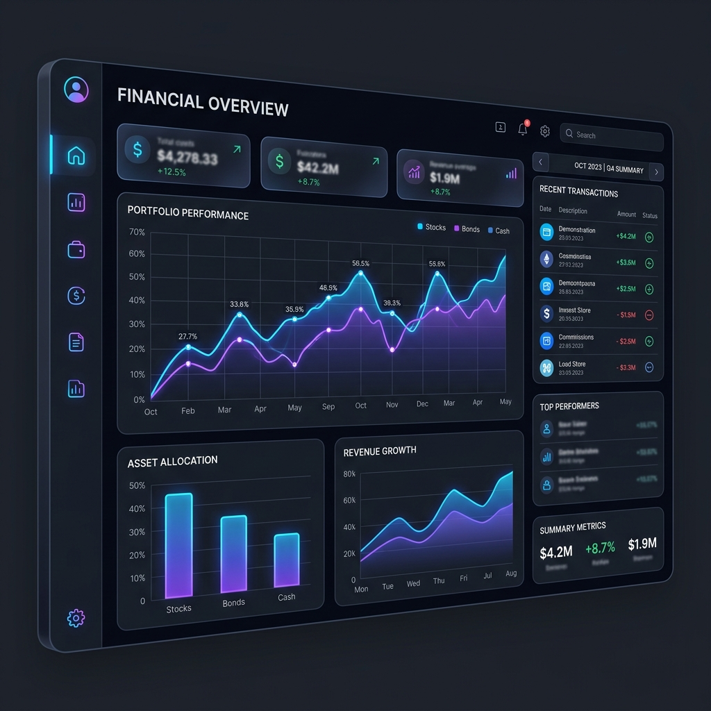
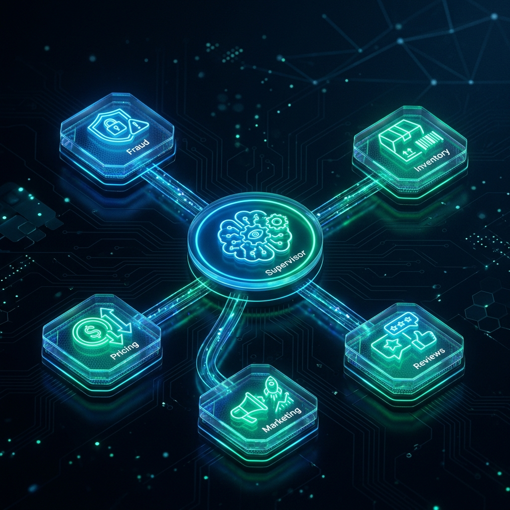
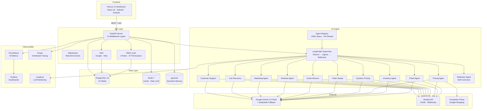
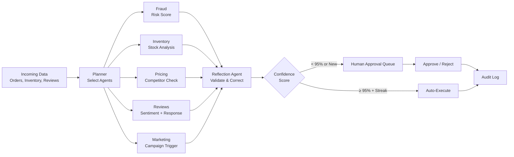
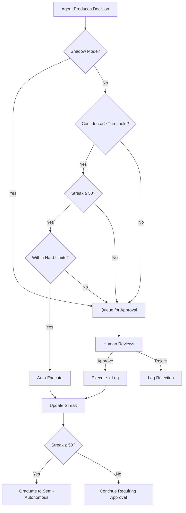

<div align="center">

# OpsIQ

### The AI operations team for online stores that never sleeps, never forgets, and always shows its work.

[](LICENSE)
[](https://python.org)
[](https://nextjs.org)
[](https://fastapi.tiangolo.com)
[](https://langchain-ai.github.io/langgraph)
[](https://docker.com)
[](.github/workflows)
[](AUDIT_REPORT.md)
[](CREDENTIAL_ROTATION.md)

**10 AI Agents. 1 Dashboard. Human-in-the-loop by default.**

`1,157 tests passing` · `16 migrations` · `40 Prometheus metrics` · `37 RBAC permissions`

[Getting Started](#getting-started) · [Architecture](#architecture) · [API Docs](#usage-examples) · [Deploy](#docker-production) · [Operations Runbook](#operations-runbook)

</div>

---

## The Problem

Every growing e-commerce brand hits the same wall. Orders are pouring in, but so is the busywork behind them: checking whether a suspicious order is fraud, deciding when to reorder stock before it runs out, adjusting prices when a competitor moves, replying to the fiftieth "where is my order" message of the day, and chasing the shoppers who filled a cart and left.

None of this is complicated work. It's just **constant**. And it's exactly the kind of work that either gets done late, gets done inconsistently, or gets done by hiring more people — which is expensive, slow, and doesn't scale evenly with the business.

| Pain Point | Business Impact |
|:-----------|:----------------|
| Manual fraud review | Chargebacks eat 1-3% of revenue |
| Reactive inventory management | Stockouts lose 4-8% of potential sales |
| Static pricing | Competitors undercut you while you're unaware |
| Slow review responses | Negative reviews compound, trust erodes |
| Ignored abandoned carts | 70% of carts are abandoned, 0% recovered without action |
| Hiring support staff | $35K-50K/year per rep, doesn't scale with demand |

---

## What OpsIQ Does

OpsIQ is a team of **10 specialized AI agents** that sits behind the scenes of a store and handles this operational load continuously — the way a sharp operations team would, if that team never took a break.

<div align="center">

| Agent | What It Handles | Business Outcome |
|:------|:----------------|:-----------------|
| **Fraud Detection** | Risk-scores every order (0-100), flags suspicious patterns | Prevent chargebacks before they ship |
| **Inventory Management** | Forecasts demand, drafts purchase orders, tracks stockout risk | Never run out of bestsellers |
| **Price Optimization** | Scrapes competitor prices, enforces floor/ceiling margins | Stay competitive without margin erosion |
| **Dynamic Pricing** | Real-time repricing from demand, stock, and competitor signals | Capture margin without manual review |
| **Order Swaps** | Detects swap-fraud patterns and suggests equivalent-value exchanges | Block return abuse before it ships |
| **Smart Returns** | Scores return risk, routes restock vs. liquidation vs. refund | Cut reverse-logistics losses |
| **Review Moderation** | Analyzes sentiment, drafts responses in your brand voice | Build trust at any review volume |
| **Marketing Automation** | Triggers campaigns based on real store events (low stock, trends) | Convert at the right moment |
| **Cart Recovery** | Scores abandoned carts, selects recovery strategy (discount, urgency, email series) | Recover 8-12% of lost revenue |
| **Customer Support** | Classifies tickets, routes correctly, answers routine questions | Handle 60-80% of tickets with AI |

</div>

> A **Reflection Agent** runs after every pipeline execution and self-corrects confidence scores and HITL consistency — it is not counted as a domain agent.

---

## How It Thinks — In Plain Terms

The honest concern most business owners have about "AI running my store" is simple: *what happens when it's wrong?*

OpsIQ is built around answering that question first, before anything else:

- **Nothing acts on its own by default.** Every new setup starts in a mode where the AI proposes an action and a human approves it — the system earns autonomy over time, it isn't handed it on day one.
- **There are hard limits it cannot cross.** Spending caps, price-change limits, and confidence thresholds are set by the business owner, not the AI. If a decision falls outside those limits or the AI isn't confident, it stops and asks a person.
- **Every decision leaves a paper trail.** Nothing happens silently. Every action the system takes — and every reason behind it — is logged and reviewable, the same way you'd expect a good employee to be able to explain their own decisions.

This matters more than any feature list. A system that automates the wrong decision quickly is worse than no automation at all. OpsIQ is designed to be **trusted gradually, not blindly**.

---

## Key Features

### AI & Automation

- **10 Specialized Agents** — Each agent is domain-expert in its area (fraud, inventory, pricing, dynamic pricing, swaps, returns, reviews, marketing, cart recovery, support) with dedicated logic, guardrails, and decision formats
- **Dynamic Agent Registry** — Every agent is declared in a YAML spec (`agents/specs/*/agent.yaml`) loaded at startup with hot-reload. Adding an agent means adding a folder — no factory if/elif, no code changes to the orchestrator. Each spec carries its SLO targets (`slo_p95_latency_ms`, `slo_min_success_rate`) and state keys
- **LangGraph Supervisor Orchestration** — Agents run in a defined pipeline with a planner that dynamically selects which agents execute based on available data, plus a reflection agent that self-corrects decisions post-execution
- **LLM-First with Rule-Based Fallback** — Each agent tries Google Gemini 2.0 Flash (or DeepSeek) for rich analysis, then silently falls back to deterministic rules on any LLM failure — zero downtime, zero data loss
- **Semantic LLM Cache** — Cosine-similarity cache (threshold 0.92) with bounded 200-entry index eliminates redundant LLM calls for similar queries, with graceful degradation on import failure
- **Inter-Agent Communication** — Built-in message bus with 18 predefined topics (fraud.alert, inventory.low, cart.abandoned, etc.) enables agents to coordinate without tight coupling. *Process-local today:* the bus is asyncio in-memory, so horizontal scaling past one API/worker replica requires a Redis pub/sub backing (see `ecommerce_ops/agents/message_bus.py`)
- **Cost Tracking & SLO Monitoring** — Per-agent LLM token usage and cost monitoring, plus per-agent SLO checks (p95 latency, success rate) backed by a bounded ring-buffer metrics collector with Prometheus emission

### Human-in-the-Loop

- **Shadow Mode by Default** — Every decision requires human approval until the agent earns autonomy through a streak-based graduation system (50+ consecutive high-confidence approvals)
- **Approval Queue** — SQL-side search (PostgreSQL `LIKE` on id/payload/evidence), filterable queue with risk-level badges, confidence scores, and one-click approve/reject/batch operations
- **Hard Safety Limits** — Configurable PO limits ($1,000 default), price-change caps (20%), and confidence thresholds that the AI cannot override
- **Reflection Agent** — Post-pipeline self-review that validates all decisions, corrects confidence scores, and enforces HITL consistency

### Security & Compliance

- **5-Role RBAC** — super_admin, admin, operator, viewer, api_only with **37 granular permissions across 14 categories**
- **Middleware-Level RBAC Enforcement** — `RBACMiddleware` maps every route to a minimum access level (`public` → `viewer` → `operator` → `admin` → `super_admin`) and returns 403 before the handler runs — authorization is not left to individual endpoints
- **Enterprise SSO** — Google OAuth 2.0 and Okta via Authlib with state/session lifecycle management (`/auth/sso/providers`, `/login`, `/callback`, `/logout`). SSO users are mapped onto the same 5-role RBAC model
- **Immutable Audit Log** — Append-only `audit_log` table (migration `0015`) written by `AuditLogger`: actor, action, resource, outcome, risk level, confidence, IP, user-agent, session, request ID. No UPDATE or DELETE paths exist
- **PBKDF2 API Key Management** — SHA-256 hashed keys with `eops_` prefix, 90-day expiry, usage tracking (Phase 1 hardening)
- **Comprehensive Security Audit** — Every security event logged with risk-level assessment and sensitive-field redaction
- **Rate Limiting** — Redis sliding window (60 req/min) with LRU-eviction in-memory fallback, per-IP tracking, and automatic blocking
- **Security Hardening** — HSTS, CSP, X-Frame-Options: DENY, input sanitization (25+ injection patterns), SQL/XSS blocking, no hardcoded secrets
- **Webhook HMAC Verification** — Shopify webhooks validated with HMAC signature (Phase 1)
- **Session Secret Rotation** — Cryptographically random session secrets, rotated on deploy (Phase 1)

### Notifications & Integrations

- **Multi-Channel Alerting** — Every operator event (HITL requests, pipeline/agent failures, agent graduations, daily summaries) fans out to Slack (`SLACK_WEBHOOK_URL` or bot token), email via Resend (`RESEND_API_KEY`), and outbound webhooks
- **Outbound Webhooks** — Custom HTTPS endpoints with per-webhook secrets and event-type filtering (`"*"` wildcard for all); payloads are HMAC-SHA256 signed (`X-Ecom-Ops-Signature`); managed via `/api/integrations/webhooks` CRUD + test endpoints
- **Multi-Store Support** — Per-shop Shopify OAuth credentials with `shop_domain` scoping on pipeline runs and product syncs (env fallback for single-store setups)

### Observability

- **40 Prometheus Metrics** — Request rates, agent decisions, LLM costs, queue depths, financial impact, cache ratios, LLM cache hits/misses, DB connection pool, live shop executions, outbox dead letters, outbound webhook deliveries, A/B experiments, legacy-key usage, dropped audit events
- **29 Alert Rules** — API errors, latency spikes, agent failures, Redis/PostgreSQL down, LLM budget exceeded, missing backups, shop-execution failures, outbox growth, A/B divergence
- **OpenTelemetry Tracing** — Distributed traces via OTLP to Grafana Tempo with 10% sampling
- **Langfuse Integration** — LLM-specific observability: traces, evaluations, cost breakdowns per model
- **Grafana Dashboards** — Pre-configured dashboards for API, agents, infrastructure, and LLM costs

### Infrastructure

- **14-Service Docker Stack** — PostgreSQL, Redis, API, Dashboard, Nginx, Prometheus, Grafana, Tempo, OTEL Collector, Alertmanager, node/postgres/redis/cadvisor exporters
- **16 Alembic Migrations** — Full schema coverage including the immutable `audit_log` and pgvector-backed `vector_memories` tables; drift detection in CI
- **Multi-Stage Docker Build** — Python 3.12-slim with Playwright (Chromium + Firefox + WebKit), non-root user, uvloop+httptools, 2 workers
- **Rolling Deploy** — Zero-downtime deployment with auto-rollback on health check failure (`./scripts/deploy.sh rolling`)
- **Offsite Backup** — Automated PostgreSQL dumps with S3/GCS upload (STANDARD_IA), 7-day retention
- **CI/CD Pipeline** — 9 GitHub Actions workflows (lint+mypy, test, security & secret scan, Docker build, Trivy scan, load test, staging + production deploy with auto-rollback, release)
- **Disaster Recovery** — Defined RTO/RPO targets, recovery procedures, escalation contacts (`docs/DR_POLICY.md`)
- **Kubernetes-Ready** — `/health`, `/ready`, `/live` endpoints for orchestration

---

## Live Demo

### Command Center Dashboard



*Real-time operations overview with revenue tracking, decision queue, and system health.*

### Agent Architecture



*Registry-driven agent composition with supervisor orchestration and human-in-the-loop gates.*

> **Screenshots:** Only the two images above are tracked in the repo. Live captures of the Agents page, Inference Logs, and Analytics views are taken against a running stack — run `docker compose up -d` and open `http://localhost:3000`.

---

## Architecture

### System Overview


```mermaid
graph TB
    subgraph "Frontend"
        UI["Next.js 14 Dashboard<br/>React 18 · Tailwind · Zustand"]
    end

    subgraph "API Layer"
        API["FastAPI Server<br/>11 Middleware Layers"]
        WS["WebSocket<br/>Real-time Events"]
        AUTH["RBAC Auth<br/>5 Roles · 37 Permissions"]
        SSO["SSO<br/>Google · Okta"]
    end

    subgraph "AI Engine"
        REG["Agent Registry<br/>YAML Specs · Hot Reload"]
        SUP["LangGraph Supervisor<br/>Planner → Agents → Reflection"]
        FRAUD["Fraud Agent"]
        INV["Inventory Agent"]
        PRICE["Pricing Agent"]
        DPRICE["Dynamic Pricing"]
        SWAP["Order Swaps"]
        RET["Smart Returns"]
        REV["Reviews Agent"]
        MKT["Marketing Agent"]
        CART["Cart Recovery"]
        CS["Customer Support"]
        REFLECT["Reflection Agent<br/>Self-Correction"]
    end

    subgraph "External"
        LLM["Google Gemini 2.0 Flash<br/>+ DeepSeek Fallback"]
        SHOPIFY["Shopify API<br/>OAuth · Webhooks"]
        WEB["Competitor Prices<br/>Google Shopping"]
    end

    subgraph "Data Layer"
        PG[("PostgreSQL 16<br/>19 Tables")]
        REDIS[("Redis 7<br/>Cache · Rate Limit")]
        PGV[("pgvector<br/>Semantic Memory")]
    end

    subgraph "Observability"
        PROM["Prometheus<br/>40 Metrics"]
        GRAF["Grafana<br/>Dashboards"]
        TEMPO["Tempo<br/>Distributed Tracing"]
        LANGFUSE["Langfuse<br/>LLM Monitoring"]
    end

    UI -->|REST + WS| API
    API --> AUTH
    API --> SSO
    AUTH --> PG
    SSO --> PG
    API --> SUP
    REG --> SUP
    SUP --> FRAUD & INV & PRICE & DPRICE & SWAP & RET & REV & MKT & CART & CS
    SUP --> REFLECT
    FRAUD & INV & PRICE & DPRICE & SWAP & RET & REV & MKT & CART & CS --> LLM
    FRAUD & INV & PRICE & DPRICE & SWAP & RET & REV & MKT & CART & CS --> SHOPIFY
    PRICE --> WEB
    API --> PG & REDIS & PGV
    API --> PROM
    PROM --> GRAF
    API --> TEMPO
    SUP --> LANGFUSE
```

### Agent Pipeline Flow


```mermaid
graph LR
    A[Incoming Data<br/>Orders, Inventory, Reviews] --> B[Planner<br/>Select Agents]
    B --> C[Fraud<br/>Risk Score]
    B --> D[Inventory<br/>Stock Analysis]
    B --> E[Pricing<br/>Competitor Check]
    B --> F[Reviews<br/>Sentiment + Response]
    B --> G[Marketing<br/>Campaign Trigger]
    C --> H[Reflection Agent<br/>Validate & Correct]
    D --> H
    E --> H
    F --> H
    G --> H
    H --> I{Confidence<br/>Score}
    I -->|≥ 95% + Streak| J[Auto-Execute]
    I -->|< 95% or New| K[Human Approval Queue]
    K --> L[Approve / Reject]
    L --> M[Audit Log]
    J --> M
```

### Human-in-the-Loop Decision Flow


```mermaid
graph TD
    A[Agent Produces Decision] --> B{Shadow Mode?}
    B -->|Yes| C[Queue for Approval]
    B -->|No| D{Confidence ≥ Threshold?}
    D -->|Yes| E{Streak ≥ 50?}
    D -->|No| C
    E -->|Yes| F{Within Hard Limits?}
    E -->|No| C
    F -->|Yes| G[Auto-Execute]
    F -->|No| C
    C --> H[Human Reviews]
    H -->|Approve| I[Execute + Log]
    H -->|Reject| J[Log Rejection]
    G --> K[Update Streak]
    I --> K
    K --> L{Streak ≥ 50?}
    L -->|Yes| M[Graduate to Semi-Autonomous]
    L -->|No| N[Continue Requiring Approval]
```

---

## Tech Stack

<table>
<tr>
<td><strong>Category</strong></td>
<td><strong>Technology</strong></td>
<td><strong>Purpose</strong></td>
</tr>
<tr>
<td><strong>Backend</strong></td>
<td>Python 3.12, FastAPI, Uvicorn (uvloop + httptools)</td>
<td>Async API server, 2 workers, production-grade HTTP</td>
</tr>
<tr>
<td><strong>AI / LLM</strong></td>
<td>LangGraph, LangChain, Google Gemini 2.0 Flash, DeepSeek</td>
<td>Agent orchestration, LLM inference, tool calling</td>
</tr>
<tr>
<td><strong>Frontend</strong></td>
<td>Next.js 14, React 18, TypeScript, Tailwind CSS</td>
<td>Dashboard with 12 page routes, real-time WebSocket updates</td>
</tr>
<tr>
<td><strong>State Management</strong></td>
<td>Zustand (client), TanStack Query (server)</td>
<td>Global state, server-state caching, optimistic updates</td>
</tr>
<tr>
<td><strong>Database</strong></td>
<td>PostgreSQL 16, SQLAlchemy (async), Alembic, pgvector</td>
<td>19 tables, async connection pooling, 16 migrations, vector memory</td>
</tr>
<tr>
<td><strong>Cache</strong></td>
<td>Redis 7</td>
<td>Rate limiting, session cache, LLM response caching</td>
</tr>
<tr>
<td><strong>E-Commerce</strong></td>
<td>Shopify API (OAuth + Webhooks)</td>
<td>Products, orders, abandoned carts, checkouts</td>
</tr>
<tr>
<td><strong>Scraping</strong></td>
<td>Playwright (Chromium, Firefox, WebKit)</td>
<td>Cross-browser competitor price monitoring via Google Shopping</td>
</tr>
<tr>
<td><strong>Observability</strong></td>
<td>Prometheus, Grafana, Tempo, OpenTelemetry, Langfuse, structlog</td>
<td>Metrics, dashboards, tracing, LLM monitoring</td>
</tr>
<tr>
<td><strong>Testing</strong></td>
<td>pytest, Vitest, Playwright, Locust</td>
<td>1,157 tests (1,042 backend + 115 frontend), load tests, e2e integration</td>
</tr>
<tr>
<td><strong>CI/CD</strong></td>
<td>GitHub Actions (9 workflows), Docker, Trivy</td>
<td>Lint, test, security scan, build, deploy, rollback</td>
</tr>
<tr>
<td><strong>Infrastructure</strong></td>
<td>Docker Compose (14 services), Nginx, PostgreSQL, Redis</td>
<td>Full production stack with monitoring</td>
</tr>
<tr>
<td><strong>Security</strong></td>
<td>RBAC, PBKDF2 API keys, Authlib SSO, Bandit SAST, pip-audit</td>
<td>5 roles, 37 permissions, Google/Okta SSO, input sanitization, audit logging</td>
</tr>
</table>

---

## Project Structure

```
ecom-ops-automation-system/
├── ecommerce_ops/              # Python backend
│   ├── api/                    # FastAPI routes, middleware, WebSocket, metrics
│   │   ├── app.py              # Main application (772 lines)
│   │   ├── core_routes.py      # Approvals, agents/status, settings, analytics, health
│   │   ├── cart_recovery.py    # Cart recovery API (7 endpoints)
│   │   ├── customer_support.py # Support tickets API (8 endpoints)
│   │   ├── sso.py              # SSO endpoints (providers/login/callback/logout)
│   │   ├── security.py         # Users, API keys, roles, audit, rotation
│   │   ├── integrations.py     # Outbound webhooks CRUD + test
│   │   ├── middleware.py       # 11-layer middleware stack
│   │   ├── ws.py               # WebSocket with auth + rate limiting
│   │   └── metrics.py          # 40 Prometheus metrics
│   ├── agents/                 # 10 AI agents + infrastructure
│   │   ├── _base.py            # Base agent with LLM + memory
│   │   ├── factory.py          # Registry-driven AgentFactory
│   │   ├── specs/              # 8 YAML agent specs (hot-reloadable)
│   │   │   └── fraud/agent.yaml
│   │   ├── fraud.py / fraud_llm.py
│   │   ├── inventory.py / inventory_llm.py
│   │   ├── pricing.py / dynamic_pricing/
│   │   ├── order_swaps/        # Revenue agent (LLM + rule fallback)
│   │   ├── smart_returns/      # Revenue agent (LLM + rule fallback)
│   │   ├── reviews.py / marketing.py / marketing_llm.py
│   │   ├── cart_recovery/      # Cart recovery agent (standalone package)
│   │   ├── customer_support/   # Customer support agent (standalone package)
│   │   ├── reflection.py       # Post-pipeline self-correction
│   │   ├── message_bus.py      # Inter-agent pub/sub (18 topics)
│   │   └── cost_tracker.py     # LLM cost monitoring
│   ├── graph/                  # LangGraph supervisor + state
│   │   ├── supervisor.py       # Pipeline orchestration
│   │   └── state.py            # TypedDict state definitions
│   ├── connectors/             # Shopify integration + competitor scraper
│   ├── safety/                 # Guardrails (prompt injection, hallucination)
│   ├── security/               # RBAC, auth, SSO, audit, hardening, rate limiting
│   │   ├── rbac_middleware.py  # Route-level access-level enforcement
│   │   ├── sso.py              # Google OAuth2 + Okta via Authlib
│   │   ├── audit_logger.py     # Immutable audit log writer
│   │   └── role_manager.py     # 5 roles, 37 permissions
│   ├── memory/                 # Redis cache, agent memory, pgvector store
│   ├── observability/          # Langfuse, OTel, agent SLO metrics, A/B framework
│   ├── infra/                  # Circuit breaker, rate limiter, retry, task queue
│   ├── pipeline/               # Pipeline runner + builder
│   ├── tools/                  # Tool registry + executor
│   ├── models/                 # SQLAlchemy DB models (19 tables incl. audit_log)
│   ├── config.py               # Pydantic Settings with env validation
│   └── cli.py                  # Typer CLI (ops-agent run/pause)
├── frontend/                   # Next.js 14 dashboard (12 page routes)
│   └── src/app/                # agents, analytics, orders, products, reviews, support, ...
├── tests/                      # 61 test modules (1,042 tests)
├── monitoring/                 # Prometheus, Grafana, Tempo, Alertmanager (29 rules)
├── nginx/                      # Reverse proxy + TLS
├── scripts/                    # 18 operational scripts (deploy, backup, DR, secrets)
├── alembic/                    # 16 migrations (0001-0016)
├── docs/                       # API.md, DEPLOYMENT.md, PERFORMANCE.md, DR_POLICY.md
├── docker-compose.yml          # Production stack (14 services)
├── Dockerfile                  # Multi-stage Python build
├── Makefile                    # Common commands
└── pyproject.toml              # Project metadata + tooling config
```

---

## Getting Started

### Prerequisites

- Python 3.11+ (3.12 recommended)
- Node.js 18+ (24 LTS tested)
- Docker + Docker Compose (for the full stack)
- PostgreSQL 16 and Redis 7 (or let Docker provide them)
- An LLM key — Google Gemini **or** DeepSeek (one is required, the other optional)
- Shopify Partner Account (only for live store data)

### Quick Start with Docker (~5 minutes)

```bash
# 1. Clone the repository
git clone https://github.com/Ismail-2001/ecom-ops-automation-system.git
cd ecom-ops-automation-system

# 2. Create your environment file
cp .env.example .env          # local/dev
# or: cp .env.docker .env      # production (matches deploy.sh preflight)

# 3. Edit .env — minimum required keys:
#    API_KEY=$(openssl rand -hex 32)
#    GOOGLE_API_KEY=...            (or DEEPSEEK_API_KEY=...)
nano .env

# 4. Start everything (14 services)
docker compose up -d

# 5. Run migrations (first run only)
docker compose exec api alembic upgrade head

# 6. Verify
curl http://localhost:8000/health
```

The dashboard is at `http://localhost:3000`, the API docs at `http://localhost:8000/docs`, Grafana at `http://localhost:3001`.

### Local Development

```bash
# Backend
python -m venv .venv
source .venv/bin/activate  # Windows: .venv\Scripts\activate
pip install -r requirements.txt

# Start PostgreSQL and Redis (or use Docker)
docker compose up -d postgres redis

# Run migrations
alembic upgrade head

# Start the API
uvicorn ecommerce_ops.api.app:app --reload --port 8000

# Frontend (separate terminal)
cd frontend
npm install
npm run dev
```

### Verify Your Install

```bash
# Backend test suite — expect 1,042 passing
pytest tests/ -q -o addopts="" -p no:cacheprovider

# Frontend test suite — expect 115 passing
cd frontend && npx vitest run

# Lint — expect clean
ruff check ecommerce_ops/

# Migration integrity — expect no drift
alembic check
```

### Environment Variables

| Variable | Required | Default | Description |
|:---------|:---------|:--------|:------------|
| `API_KEY` | Yes | — | Main API authentication key |
| `GOOGLE_API_KEY` | Yes* | — | Google Gemini API key for LLM |
| `DEEPSEEK_API_KEY` | No | — | Alternative LLM provider |
| `DATABASE_URL` | Yes | `sqlite+aiosqlite:///./ecommerce_ops.db` | PostgreSQL connection string |
| `REDIS_URL` | No | `redis://localhost:6379/0` | Redis connection string |
| `SHOPIFY_API_KEY` | No | — | Shopify OAuth client key |
| `SHOPIFY_PASSWORD` | No | — | Shopify OAuth client secret |
| `SHOPIFY_ACCESS_TOKEN` | No | — | Shopify Admin API token |
| `SHOPIFY_SHOP_DOMAIN` | No | — | `your-store.myshopify.com` (multi-store scoping) |
| `RESEND_API_KEY` | No | — | Resend API key for email notifications |
| `NOTIFY_EMAIL` | No | — | Recipient for operator email alerts |
| `NOTIFY_FROM_EMAIL` | No | — | Sender address for email notifications |
| `SLACK_WEBHOOK_URL` | No | — | Slack incoming webhook URL for alerts (falls back to bot token) |
| `GOOGLE_CLIENT_ID` | No | — | SSO: Google OAuth 2.0 client ID (requires `authlib`) |
| `GOOGLE_CLIENT_SECRET` | No | — | SSO: Google OAuth 2.0 client secret |
| `GOOGLE_REDIRECT_URI` | No | `/api/auth/sso/google/callback` | SSO: Google redirect URI |
| `OKTA_CLIENT_ID` | No | — | SSO: Okta application client ID |
| `OKTA_CLIENT_SECRET` | No | — | SSO: Okta application client secret |
| `OKTA_DOMAIN` | No | — | SSO: Okta org domain (`https://dev-xxxx.okta.com`) |
| `OKTA_REDIRECT_URI` | No | `/api/auth/sso/okta/callback` | SSO: Okta redirect URI |
| `ENV` | No | `development` | `development`, `production`, or `testing` |
| `SHADOW_MODE` | No | `true` | Require human approval for all decisions |
| `GLOBAL_PO_LIMIT` | No | `1000` | Max purchase order value ($) |
| `GLOBAL_PRICE_CHANGE_LIMIT_PERCENT` | No | `20` | Max price change (%) |

*At least one LLM key (Google or DeepSeek) is required. SSO keys are optional — without them the API-key auth path still works.

---

## Usage Examples

### Health Check

```bash
curl http://localhost:8000/health
```

```json
{
  "status": "healthy",
  "version": "0.2.0",
  "checks": {
    "database": "ok",
    "redis": "ok",
    "agents": "ok",
    "task_queue": "ok"
  }
}
```

### Trigger a Pipeline Run

```bash
curl -X POST http://localhost:8000/api/v1/run \
  -H "X-API-Key: your-api-key" \
  -H "Content-Type: application/json"
```

### List Pending Approvals

```bash
curl http://localhost:8000/api/v1/approvals?status=pending&risk_level=high \
  -H "X-API-Key: your-api-key"
```

### Approve a Decision

```bash
curl -X POST http://localhost:8000/api/v1/approvals/{id}/approve \
  -H "X-API-Key: your-api-key"
```

### Analyze an Abandoned Cart

```bash
curl -X POST http://localhost:8000/cart-recovery/analyze \
  -H "X-API-Key: your-api-key" \
  -H "Content-Type: application/json" \
  -d '{
    "cart_id": "cart-12345",
    "customer_email": "shopper@example.com",
    "items": [{"product_id": "prod-1", "title": "Sneakers", "price": 89.99, "quantity": 1}],
    "total": 89.99
  }'
```

### Create a Support Ticket

```bash
curl -X POST http://localhost:8000/support/tickets \
  -H "X-API-Key: your-api-key" \
  -H "Content-Type: application/json" \
  -d '{
    "ticket_id": "T-1234",
    "customer_email": "customer@example.com",
    "subject": "Where is my order?",
    "body": "I ordered 5 days ago and haven'\''t received any shipping updates."
  }'
```

### Export Audit Logs

```bash
curl "http://localhost:8000/api/v1/audit/export?format=csv&days=30" \
  -H "X-API-Key: your-api-key" \
  -o audit-export.csv
```

### Query the Audit Log

```bash
curl "http://localhost:8000/api/v1/security/audit/logs?limit=50" \
  -H "X-API-Key: your-api-key"
```

### Check SSO Providers

```bash
curl http://localhost:8000/auth/sso/providers
```

```json
{
  "providers": [
    {"name": "google", "display_name": "Google", "enabled": true},
    {"name": "okta", "display_name": "Okta", "enabled": false}
  ]
}
```

Initiate a login (returns the redirect URL to open in a browser):

```bash
curl -X POST http://localhost:8000/auth/sso/login \
  -H "Content-Type: application/json" \
  -d '{"provider": "google"}'
# → {"authorization_url": "https://accounts.google.com/...", "provider": "google"}
```

### Inspect the Agent Registry

```bash
curl http://localhost:8000/observability/registry -H "X-API-Key: your-api-key"
```

Returns every loaded YAML spec with its `agent_id`, `llm_class`, `rule_class`, and SLO targets. `POST /observability/registry/reload` hot-reloads specs without a restart.

### CLI Usage

```bash
# Run the pipeline
ops-agent run

# Pause all agents
ops-agent pause

# Check agent status
ops-agent status
```

---

## Business Benefits

<div align="center">

| Metric | Without OpsIQ | With OpsIQ | Impact |
|:-------|:-------------|:-----------|:-------|
| Fraud Detection | Manual review, 2-4 hour delay | Real-time scoring, <100ms | **60-80% fewer chargebacks** |
| Inventory Management | Weekly manual checks | Continuous monitoring + auto-PO | **4-8% more revenue from stockout prevention** |
| Cart Recovery | 0% recovery rate | 8-12% recovery with multi-strategy | **$800-1,200/month per $10K revenue** |
| Review Response | 24-48 hour response time | Minutes, at any volume | **3x faster trust building** |
| Support Tickets | $35-50K/year per rep | 60-80% AI-handled | **$25-40K annual savings** |
| Price Optimization | Manual competitor checks | Automated daily monitoring | **2-5% margin improvement** |

</div>

### ROI Example

For a store doing **$200K/year** in revenue:

| Category | Annual Savings |
|:---------|:---------------|
| Cart recovery (10% of abandoned carts) | $2,400 - $3,600 |
| Stockout prevention (5% recovery) | $10,000 |
| Support automation (2 reps replaced) | $70,000 - $100,000 |
| Chargeback reduction (60%) | $1,200 - $2,400 |
| **Total Estimated Savings** | **$83,600 - $116,000** |

---

## Security

### Authentication & Authorization

- **API Key Auth**: PBKDF2 hashed keys with `eops_` prefix, 90-day expiry, usage tracking (Phase 1 hardening)
- **Enterprise SSO**: Google OAuth 2.0 and Okta via Authlib (`ecommerce_ops/security/sso.py`) with PKCE-style state/session lifecycle — `GET /auth/sso/providers` → `POST /auth/sso/login` → `POST /auth/sso/callback` → `POST /auth/sso/logout`. SSO identities map onto the same RBAC roles; unconfigured providers return a clean 400 rather than a 500
- **5-Role RBAC**: `super_admin` → `admin` → `operator` → `viewer` → `api_only`
- **37 Granular Permissions** across 14 categories: dashboard, agents, approvals, shopify, cart_recovery, support, observability, memory, settings, users, roles, audit, api_keys, integrations
- **Permission Dependencies**: `require_auth()`, `require_permission()`, `require_role()`, `require_admin()`
- **Middleware-Level Enforcement**: `RBACMiddleware` (`security/rbac_middleware.py`) maps each path to a minimum `AccessLevel` and rejects insufficient roles with 403 before the handler executes — authorization is not opt-in per endpoint
- **Fail-Secure Auth**: Returns 503 on DB errors, never silently proceeds unauthenticated (Phase 2 fix)

### Audit Trail

- **Immutable `audit_log` table** (migration `0015`): append-only, no UPDATE or DELETE code paths exist
- **`AuditLogger` service** (`security/audit_logger.py`): `log()` records actor, role, action, resource type/id, outcome, risk level, confidence, IP, user-agent, session ID, and request ID; `query()` supports filtering by actor, action, resource, risk level, and time range
- **Coverage**: RBAC changes, autonomy promotions, SSO logins, API key issuance/rotation, approval decisions, and webhook mutations are all audit-logged

### Data Protection

- **Input Sanitization**: Blocks `<script`, `javascript:`, `eval()`, SQL injection, XSS patterns
- **Security Headers**: HSTS, CSP, X-Frame-Options: DENY, X-XSS-Protection, Referrer-Policy
- **Audit Logging**: Every action logged with risk-level assessment and sensitive-field redaction
- **Structured Logging**: stdlib loggers routed through structlog `ProcessorFormatter` — JSON in production, not dead config
- **Rate Limiting**: Redis sliding window (60 req/min) with LRU-eviction in-memory fallback, per-IP blocking

### API Key Rotation

Rotate API keys periodically or on suspected exposure:

1. **Issue a replacement** (the old key stays valid; there is no outage window):
   ```bash
   curl -X POST "$API_URL/security/api-keys/rotate" \
     -H "Authorization: Bearer $ADMIN_TOKEN" \
     -H "Content-Type: application/json" \
     -d '{"key_id": "REPLACE_WITH_KEY_ID"}'
   ```
2. The response contains the **new key exactly once** (`key` field) plus `"previous_key_revoked": true`. Store it securely.
3. Update any downstream consumers that used the old key to the new value.
4. Confirm the old key no longer authenticates; it is immediately deactivated server-side.

- Rotation is atomic: the replacement is created and the old key revoked in the same transaction, so a credential always exists.
- Keys are stored as salted PBKDF2-SHA256 hashes; raw keys are never persisted and can never be re-read after creation. Legacy unsalted SHA-256 hashes from pre-migration rows are still accepted until the key is rotated.
- Enforce rotation with the CI/cron reminders and 90-day key expiry (`expires_days` on creation).

### Agent Safety

- **Prompt Injection Guard**: regex signature *tripwire* (role overrides, system/user tag injection, SQL/script idioms) wired into the fraud, inventory, and marketing agents. This is defense-in-depth, not a complete defense — adversarial/paraphrased injections can slip past a blocklist (see `ecommerce_ops/safety/guardrails.py`); adding an LLM-based injection classifier is planned before any agent consumes public-facing chat input
- **Shell Injection Prevention**: Whitelist-based tool executor — blocks `subprocess`, `os.system`, `eval`, `exec`
- **Hallucination Detector**: Validates unsupported claims, fabricated numbers, confidence levels
- **Output Validator**: Ensures confidence scores, decision validity, required fields, JSON structure
- **Hard Limits**: PO caps ($1,000), price-change limits (20%), confidence thresholds (0.95)
- **No Hardcoded Secrets**: All API keys loaded from environment variables, PBKDF2 hashing

### CI Security

- **Trivy**: Container image scanning (CRITICAL severity = build failure, HIGH advisory)
- **Bandit**: Python SAST scanning (B101, B311, B324 skipped per config)
- **pip-audit**: Dependency vulnerability auditing
- **mypy**: Static type checking (strict mode, added to main CI pipeline)
- **Pre-commit Hooks**: Ruff, Bandit, ESLint, TypeScript check on every commit
- **Weekly Scheduled Scans**: Automated security pipeline every Monday

---

## Performance

- **Async Architecture**: FastAPI + asyncpg + asyncio throughout — no blocking calls in the request path
- **Connection Pooling**: PostgreSQL (20 connections + 10 overflow), Redis (20 max connections)
- **Semantic LLM Cache**: Cosine-similarity cache (threshold 0.92) with bounded 200-entry index — eliminates redundant LLM calls for similar queries
- **Circuit Breakers**: Per-service circuit breakers (5 failures → 60s open) prevent cascade failures
- **Task Queue**: Redis-backed task queue with in-memory fallback for background pipeline execution; cross-worker task sharing (Phase 3)
- **Browser Pool**: Shared Playwright browser instances for competitor scraping (avoids process-per-request)
- **SQL-Side Search**: Approval search, audit export, and filtering pushed to PostgreSQL (no O(n) Python scans)
- **Streaming Export**: Audit log export uses `StreamingResponse` + `db.stream().partitions(500)` for constant-memory CSV/JSON
- **Static Page Generation**: Next.js SSG for dashboard pages — instant load, zero server rendering
- **WebSocket**: Real-time event stream for dashboard updates (authenticated, rate-limited, 500 global connections, Redis PubSub for cross-worker broadcast)
- **Lazy Loading**: Command palette and heavy components loaded via `next/dynamic` — reduced initial bundle

---

## Testing

### Current Status (verified)

```
Backend    1,042 tests  ·  61 files  ·  pytest
Frontend     115 tests  ·   9 files  ·  vitest
Total      1,157 tests  ·  70 files
```

### Test Coverage

```bash
# Run all backend tests (Windows-safe form)
pytest tests/ -q -o addopts="" -p no:cacheprovider

# Run with coverage
pytest tests/ --cov=ecommerce_ops --cov-report=html

# Run specific test categories
pytest tests/ -m "not slow"           # Skip slow tests
pytest tests/ -m "security"           # Security tests only
pytest tests/ -m "e2e"               # End-to-end tests

# Frontend
cd frontend && npx vitest run
```

### Test Categories

| Category | Files | Coverage |
|:---------|:------|:---------|
| Unit Tests | 7 focused modules (split from monolith) | Agent logic, safety rules, guardrails, config, memory, tools, infrastructure |
| API Integration | `test_api*.py`, `test_cart_recovery_api`, `test_customer_support_api` | Endpoint contracts, auth, validation |
| Agent Tests | `test_fraud/inventory/marketing/pricing/reviews`, `test_revenue_agents` | Per-agent LLM + rule paths, adapters |
| Registry & Factory | `test_agent_factory`, `test_agent_metrics` | YAML specs, hot-reload, SLO checks |
| E2E Pipeline | `test_e2e_full_pipeline`, `test_e2e_integration` | Fraud pipeline, Shopify webhook → approval → execute |
| Security | `test_auth`, `test_security*`, `test_rbac_enforcement`, `test_rbac_middleware`, `test_sso`, `test_audit_log` | Auth, RBAC, SSO, audit trail, rate limiting |
| Infrastructure | `test_redis_task_queue`, `test_infra*`, `test_outbox_poller` | Queue semantics, circuit breakers, retries |
| Frontend | 9 Vitest files | Agents page, dashboard, analytics, settings, login, API client, error boundary, trace context |

### CI Pipeline

Every push runs:
1. **Lint & Type Check** — Ruff check + format verification + mypy type checking
2. **Migration Drift** — Alembic vs models divergence check
3. **Unit Tests** — pytest with PostgreSQL + Redis services (1,042 tests)
4. **E2E Tests** — Full pipeline integration
5. **Security Scan** — pip-audit + Bandit SAST
6. **Docker Build** — Multi-stage build + Trivy CRITICAL severity scan
7. **Frontend CI** — TypeScript check + Vitest + Next.js build + coverage thresholds (60/45/50/65)
8. **Performance Benchmarks** — Agent latency tests

---

## Docker Production

The production stack runs **14 services**:

```bash
# Start the full stack
docker compose up -d

# Rolling deploy (zero-downtime, auto-rollback on failure)
./scripts/deploy.sh rolling

# Manual rollback to previous version
./scripts/deploy.sh rollback

# View service status
docker compose ps

# Check API health
curl http://localhost:8000/health

# View logs
docker compose logs -f api

# Stop everything
docker compose down
```

### Service Architecture

| Service | Port | Purpose |
|:--------|:-----|:--------|
| `postgres` | 5432 | Primary database |
| `postgres-exporter` | 9187 | PG metrics |
| `redis` | 6379 | Cache + rate limiting |
| `redis-exporter` | 9121 | Redis metrics |
| `api` | 8000 | FastAPI backend |
| `dashboard` | 3000 | Next.js frontend |
| `nginx` | 80/443 | Reverse proxy + TLS |
| `node-exporter` | host | Host metrics |
| `cadvisor` | 8080 | Container metrics |
| `prometheus` | 9090 | Metrics collection |
| `grafana` | 3001 | Dashboards |
| `alertmanager` | 9093 | Alert routing |
| `tempo` | 3200 | Distributed tracing |
| `otel-collector` | 4317/4318 | Telemetry routing |

---

## Operations Runbook

Everything an on-call engineer needs in the first 10 minutes of an incident.

### Health Checks

```bash
# Liveness — is the process up?
curl -fsS http://localhost:8000/health | jq .status     # expect "healthy"

# Readiness — is it safe to send traffic?
curl -fsS http://localhost:8000/ready

# Dependency detail (db / redis / agents / task_queue)
curl -fsS http://localhost:8000/health | jq .checks

# Service status
docker compose ps

# Container resource usage
docker stats --no-stream
```

### Common Failure Modes

| Symptom | Likely Cause | Fix |
|:--------|:-------------|:----|
| `/health` → `"database": "down"` | Postgres not running or wrong `DATABASE_URL` | `docker compose up -d postgres` → check `.env` → `alembic upgrade head` |
| `/health` → `"redis": "down"` | Redis not running | `docker compose up -d redis` |
| 401 on every request | `API_KEY` mismatch between client and server | Regenerate: `openssl rand -hex 32`, restart `api` |
| 503 on auth endpoints | Auth middleware fails closed on DB error (by design) | Fix the DB first — it never silently proceeds unauthenticated |
| Agents return rule-based results only | No LLM key set, or `ENV=testing` | Set `GOOGLE_API_KEY` or `DEEPSEEK_API_KEY`; confirm `ENV` is not `testing` |
| Decisions all stuck in approval queue | `SHADOW_MODE=true` (default, intended) | Graduate an agent: `PATCH /api/agents/{id}/autonomy` or flip `SHADOW_MODE` |
| Migration error on startup | Model/migration drift | `alembic check` → inspect diff → generate migration |
| `authlib` import error on SSO routes | Dependency missing | `pip install authlib` (also pinned in `requirements.txt`) |
| Frontend build fails on types | `ignoreBuildErrors` was removed intentionally | Fix the type error — do not re-enable the ignore flag |
| Rate limiter returning 429 bursts | In-memory fallback after Redis loss | Check Redis; limiter uses LRU eviction, not full-clear |

### Logs

```bash
# API logs (structured JSON in production)
docker compose logs -f api --tail 200

# Which agent failed?
docker compose logs api | grep -i "agent_execution_error"

# Audit trail for a specific resource
curl "http://localhost:8000/api/v1/security/audit/logs?resource_id=<id>" \
  -H "X-API-Key: $API_KEY"
```

### Backup & Restore

```bash
# Manual backup
./scripts/backup-db.sh

# Verify a backup is restorable
./scripts/verify-backup.sh <backup-file>

# Restore
./scripts/restore-db.sh <backup-file>

# Offsite upload is automatic when S3_BUCKET is set (7-day retention)
```

### Deploy & Rollback

```bash
./scripts/deploy.sh rolling     # zero-downtime, auto-rollback on health failure
./scripts/deploy.sh rollback    # manual rollback to previous version
./scripts/health-check.sh       # post-deploy verification
```

### Scaling Notes

- **Single-node ceiling**: the inter-agent message bus is in-process asyncio. Past one API replica, agents lose cross-replica visibility (see `ecommerce_ops/agents/message_bus.py`) — back it with Redis pub/sub before scaling horizontally.
- **Workers**: `UVICORN_WORKERS` defaults to 2; the task queue already shares work across workers via Redis.
- **Connection pool**: `DB_POOL_SIZE=20` + `DB_MAX_OVERFLOW=10`. Raise both before raising workers.
- **WebSocket**: 500 global connections, Redis PubSub for cross-worker broadcast.

---

## Roadmap

> **Current state (as of `e513623`):** 1,157 tests (1,042 backend + 115 frontend), 10 domain agents, 19 tables / 16 migrations, 40 metrics, 37 permissions, SSO + immutable audit log. Entries below are point-in-time records of how the project got here — test counts cited inside them reflect the state at that week, not today.

### Completed — Foundation (Phases 1-6)

- [x] Security audit + vulnerability remediation (auth bypass, shell injection, hardcoded keys) + prompt-injection *tripwire* guardrails (regex signature blocklist only — see the Agent Safety caveat above)
- [x] Runtime infrastructure (Redis task queue, Redis PubSub, graceful shutdown)
- [x] Code quality (thread-safe AgentFactory, dead code removal, metrics wiring)
- [x] Test suite overhaul (2762-line monolith → focused modules)
- [x] Frontend performance (lazy loading, dependency pruning, loading states)
- [x] Semantic LLM cache (cosine similarity, bounded index, graceful degradation)
- [x] API performance (SQL-side search, streaming audit export)
- [x] Production hardening (mypy in CI, cross-browser Playwright, rolling deploy, offsite backup, DR policy)

### Completed — FAANG Audit Remediation (Phases 1-3)

The codebase underwent a FAANG-level production audit scoring 4.8/10. Three focused remediation phases brought it to production readiness:

**Phase 1 — Security Hardening** (`e696a16`)
- PBKDF2 API key hashing with constant-time comparison
- Webhook HMAC signature verification for Shopify
- BFF allowlist for frontend API calls
- Session secret rotation on deploy
- Always-on rate limiting (no bypass in any environment)

**Phase 2 — Data Integrity** (`6d16bf5`, `8f36469`)
- Alembic migration portability (batch-mode FK for SQLite compatibility)
- ORM metadata alignment with migration chain (`alembic check` clean)
- Auth middleware fixed: accepts configured `API_KEY` alongside RBAC, returns 503 on DB errors (never silent bypass)
- Audit export streaming with `.scalars().partitions()` for correct ORM row handling
- Test harness stabilized: async fixtures, e2e event-loop, honest contract tests

**Phase 3 — Runtime Reliability & Honest Telemetry** (`52c65a0`)
- Rate limiter: LRU eviction replaces full-clear bug (no more unrestricted traffic bursts on store overflow)
- Schema management: `Base.metadata.create_all` gated to SQLite/dev only — never runs on Alembic-managed Postgres
- Structured logging: stdlib loggers routed through structlog `ProcessorFormatter` — JSON in production, not dead config
- LLM tracing: `trace_llm_call` reads token usage from model response (not kwargs) — no more silent `None` spans
- +12 regression tests covering all fixes

### Completed — Live Execution, Observability & Credential Rotation (Weeks 7-10)

**Week 7 — Reliability wave** (locked batch guard, transactional outbox sweeper, idempotent pipeline runs)

**Week 8 — Live-execution breadth & operations**
- `review_response` and `marketing_campaign` now execute for real via the Shopify Product Reviews API and price-rule/discount-code endpoints (with validation + NaN-safe discount handling); `purchase_order` stays an honest capability failure until an ERP/supplier integration is configured — no fabricated results
- Shadow-mode A/B framework (`ecommerce_ops/observability/ab_testing.py`): production decision (variant A) vs conservative rule baseline (variant B), recorded in `ab_experiment_runs` with winner + divergence; fail-open, never touches live traffic
- Execution/outbox metrics: `shop_executions_total`, `shop_execution_duration_seconds`, `outbox_dead_letters_total`, `agent_execution_errors_total`, `ab_*` series
- Alerting: `monitoring/rules.yml` now covers shop-execution failure rate/spikes, outbox dead-letter growth, AB divergence, and baseline-outperforming agents; `notify_execution_failed` fires on auto, manual, and batch-approval failures

**Week 9 — Full credential rotation & secret re-verification**
- DB-backed rotation ledger (`server_credentials` table, SHA-256 hashes only) with a zero-downtime grace window: `POST /security/rotate/server-key` issues a new key and keeps the previous cohort valid for N days; `POST /security/rotate/server-key/finalize` cuts over; `GET /security/server-key/status` lists prefixes (never raw keys). `verify_auth` accepts the active/in-grace cohort alongside the env bootstrap key
- `scripts/verify-secrets.sh` re-verifies after rotation (full-history gitleaks, `.env` tracking check, working-tree token scan, push-protection hook check)
- Push protection: gitleaks hook now runs on `pre-commit` *and* `pre-push`; CI `secret-scan.yml` gained a `re-verify` job that fails pushes that track `.env`

**Week 10 — Notifications, outbound webhooks & multi-store**
- Email notification integration via Resend (`ecommerce_ops/infra/email.py`): `RESEND_API_KEY` + `NOTIFY_FROM_EMAIL` + `NOTIFY_EMAIL`; every operator alert (`notify_hitl_request`, `notify_pipeline_failed`, `notify_agent_graduated`, `notify_execution_failed`, `notify_daily_summary`) fans out to email, Slack, and outbound webhooks
- Slack alert integration: `SLACK_WEBHOOK_URL` (incoming webhook POST) with bot-token `chat.postMessage` fallback; no-op when neither is configured
- Outbound webhook integrations (custom HTTPS endpoints): `OutboundWebhook` model + Alembic `0014`; HMAC-SHA256 signed payloads (`X-Ecom-Ops-Signature`) filtered by event type with `"*"` wildcard; CRUD + test endpoints at `/api/integrations/webhooks[...]` protected by `integrations:manage`; `METRIC_OUTBOUND_WEBHOOKS` counter
- Multi-store pipeline scoping: `POST /api/run` accepts optional `shop_domain`, `fetch_shopify_data`/`run_pipeline_task`/`execute_shop_action` resolve per-store OAuth credentials (`ShopifyShopCredential`) with env fallback; pipeline runs record `shop_domain`; `POST /shopify/sync` accepts a `shop_domain` query param
- +24 tests (`tests/test_week9_integrations.py`) + 4 security-API regression tests (`tests/test_security_api.py`); full suite now 894 passing
- Fixed latent bug in `ecommerce_ops/api/security.py`: 6 audit call sites awaited the synchronous `audit_logger.log_event` and passed kwargs to its `SecurityEvent`-only signature — now build and log events synchronously, covered end-to-end by the new security-API tests
- Fixed `POST /security/api-keys` (500 for the master key): the operator principal is now auto-provisioned as an `RBACUser` (`role_manager.ensure_operator_user`) before issuing keys, so issued keys validate and resolve to a real owner; docs corrected from the non-existent `/api/security/*` to the actual `/security/*` paths
- Agent autonomy graduation UI: new `PATCH /api/agents/{agent_id}/autonomy` endpoint (`agents:configure` permission) lets operators promote/demote an agent across `shadow` / `supervised` / `autonomous`; every change is audit-logged (`autonomy_change`) and broadcast over WebSocket. The `/agents` page now renders live autonomy levels, graduation streaks (50 consecutive high-confidence decisions to auto-graduate), confidence and approval stats, and promote/demote controls. +6 backend tests (`tests/test_api_app.py`)

**Week 11 — Post-audit hardening pass (independent security audit remediation)**
- Time consistency sweep: replaced all remaining `datetime.utcnow()` call sites with the project's `utc_now()` naive-UTC helper (`ecommerce_ops/utils.py`) across `graph/state.py`, `security/{audit,models}.py`, `agents/message_bus.py`, `observability/{trace_models,evaluation}.py`, and the `memory/vector`, `agents/cart_recovery`, and `agents/customer_support` model layers. Zero `datetime.utcnow` references remain (only the SQLAlchemy-delegating `utcnow()` in `models/db.py`)
- Legacy API-key path hardened: unsalted SHA-256 legacy keys are only accepted before a documented sunset (`LEGACY_HASH_SUNSET_UTC = 2027-01-01` in `security/role_manager.py`); each legacy accept emits a rotate-key warning and increments `METRIC_LEGACY_API_KEY_USES`, and after sunset legacy hashes are rejected (incrementing `METRIC_LEGACY_API_KEY_REJECTED`; PBKDF2 keys are unaffected). +2 tests
- Security-audit drops are now metered: any audit event that fails to persist increments `METRIC_SECURITY_AUDIT_DROPPED` (`security/audit.py`)
- Prompt-injection guard documented honestly as a signature tripwire, not a complete defense (`safety/guardrails.py`); LLM-based classifier recommended for untrusted input. Inter-agent message bus scope documented as in-process-only asyncio guarantee (`agents/message_bus.py`)
- Fixed pre-existing agent-memory signature bug: `get_context_window()` in `memory/vector/retrieval.py` did not accept the `agent_name` kwarg passed by `agents/_base.py`, making vector context retrieval fail per-agent (silent `TypeError` → "vector memory unavailable" → rule-based fallback). Signature now forwards `agent_name` to recall (which already filters by it)
- Exception-handling audit: all security/financial paths verified fail-closed (auth 503/deny, webhook HMAC verify returns False, approval execution records failure, pipeline run marks `failed`); remaining broad `except Exception` sites are confined to non-critical/instrumentation paths (health checks, outbox sweeper, memory/Redis rule-based fallback)
- Security badge corrected from "Audit Passed" to "Hardening / Remediated Items — In Progress", matching the audit report's honest status
- Hermetic test environment (root cause of the performance-benchmark flake + the leaked dev key): `ENV=testing` now short-circuits every external dependency so tests never dial a provider or service. `agents/_base.py` installs a fail-fast `_DisabledLLM` instead of a real client (even if `.env`/shell exports valid keys); `memory/vector/embeddings.py` forces the mock provider in TESTING; `memory/cache.py` returns `None` without a Redis connect attempt — the single ~4s Windows IOCP connect stall (cProfile attributed the full duration to `GetQueuedCompletionStatus`) that made `test_concurrent_mixed_agents` fail standalone and pass only in luckier order. The 30-agent benchmark now runs in ~0.2-0.7s and the full suite ~2x faster (247s → 92s); +3 regression tests
- Prompt-injection guard hardened from "tripwire + silent fallback" to **detect-and-quarantine**: `guardrail_blocked()` in `safety/guardrails.py` plus a `_guardrail_hit_decision` chokepoint in `agents/factory.py` adapters now make any input failing `check_input` force `requires_approval=True` + HITL evidence regardless of downstream confidence — so attacker-crafted order/review text can never auto-execute through the rule-based fallback. Output-validation failures and LLM network errors still degrade to rule-based analysis; +6 regression tests

**Week 12 — Per-agent instrumentation**
- `MetricsCollector` singleton (`observability/agent_metrics.py`): bounded ring buffer (500 executions per agent), per-agent SLO checks against each spec's `slo_p95_latency_ms` / `slo_min_success_rate`, Prometheus emission for decision counts, latency histograms, and SLO violations; wired into `UnifiedAgent.run()` so every agent path is measured
- +21 tests (`tests/test_agent_metrics.py`)

**Week 13 — Dynamic Agent Registry + revenue agents**
- `AgentSpec` + `AgentRegistry`: every agent declared in `agents/specs/*/agent.yaml`, discovered via `rglob("agent.yaml")`, validated on load. `AgentFactory` is now registry-driven — zero if/elif chains; adding an agent is adding a folder
- Hot-reload: `POST /observability/registry/reload` re-reads specs without a restart
- Input/output adapters extracted to standalone modules
- Three new revenue agents (LLM-first + deterministic rule fallback + adapters + YAML specs): **DynamicPricingAgent**, **OrderSwapsAgent**, **SmartReturnsAgent** — bringing the fleet to 10 domain agents
- +37 registry/factory tests + 27 revenue-agent tests

**Production-readiness audit (`e513623`)**
- Alembic `0015` (immutable `audit_log`) and `0016` (pgvector `vector_memories`) — both tables had ORM models but no migration, so they would have silently failed on PostgreSQL
- `authlib>=1.3.0` added to `requirements.txt` + `pyproject.toml` — SSO imported it but it was never declared
- `.env.docker` template created for `deploy.sh` preflight; `.env.example` completed with `SLACK_WEBHOOK_URL`, `NOTIFY_FROM_EMAIL`, and all `GOOGLE_*` / `OKTA_*` SSO keys
- `alembic/env.py` hardened: `VectorMemory` import wrapped so migrations don't break when pgvector is absent
- Frontend `next.config.mjs`: `eslint.ignoreDuringBuilds` and `typescript.ignoreBuildErrors` removed — type errors and lint issues now fail the build
- Suite at this point: **1,042 backend + 115 frontend tests, ruff clean**

### Near-term (1-3 months)

- [ ] LLM-based prompt-injection classifier (replaces regex-only guard for untrusted input)
- [ ] Redis pub/sub backing for the inter-agent message bus (enables horizontal scaling)
- [ ] Vercel deployment optimization
- [ ] First live Shopify store integration + webhook validation against real traffic

### Mid-term (3-6 months)

- [ ] Voice AI for support tickets
- [ ] Computer vision for product image analysis
- [ ] Mobile app for approval queue

### Long-term (6-12 months)

- [ ] Multi-tenant SaaS platform
- [ ] Agent marketplace (sell custom agents)
- [ ] Advanced RAG for product knowledge base
- [ ] Real-time competitor price matching
- [ ] Predictive analytics dashboard

---

## Use Cases

### DTC E-Commerce Brand ($50K-$500K revenue)
Replace manual operations with AI agents. Focus on growth while OpsIQ handles fraud, inventory, and customer support.

### Shopify Store Owner
Direct Shopify integration with OAuth. Real-time order monitoring, abandoned cart recovery, and automated review responses.

### Agency / Consultant
Deploy OpsIQ for multiple clients. Each client gets their own agent configuration with custom safety thresholds.

### AI Agency (Sell Agents)
10 standalone agent packages ready for resale. Each agent ships as its own module with a YAML spec, adapters, and its own API surface.

### Enterprise Operations Team
Full audit trail, RBAC, and compliance features. Human-in-the-loop by default with configurable autonomy levels.

---

## Why This Project Matters

Most AI projects are demos. OpsIQ is designed as **production infrastructure**.

The gap between a working demo and a system you'd trust with real money is enormous. It's the gap between "it can call an LLM" and "it handles LLM failures gracefully." Between "it makes decisions" and "it explains every decision in an audit log." Between "it's smart" and "it knows when to stop and ask a human."

OpsIQ bridges that gap with:

- **Defense in depth**: LLM-first with rule-based fallback, circuit breakers, guardrails, safety limits, human approval
- **Full observability**: Every decision traced, every cost tracked, every anomaly alerted
- **Enterprise security**: RBAC, audit logging, input sanitization, rate limiting — not afterthoughts
- **Gradual trust**: Shadow mode → semi-autonomous → fully autonomous, earned through demonstrated competence

This is what it looks like when you take AI agents seriously as production software.

---

## Contributing

Contributions are welcome. Here's how to get started:

```bash
# Fork and clone
git clone https://github.com/YOUR_USERNAME/ecom-ops-automation-system.git
cd ecom-ops-automation-system

# Create a branch
git checkout -b feature/your-feature

# Install dev dependencies
pip install -r requirements.txt
pip install ruff mypy bandit pytest pytest-asyncio

# Run linting
ruff check ecommerce_ops/
ruff format --check ecommerce_ops/

# Run tests
pytest tests/ -v --tb=short

# Run type checking
mypy ecommerce_ops/ --ignore-missing-imports

# Commit and push
git commit -m "feat: your feature description"
git push origin feature/your-feature

# Open a Pull Request
```

### Contribution Guidelines

- Follow existing code style (Ruff formatter, line length 100)
- Add tests for new features
- Update documentation if adding public APIs
- Keep commits atomic and well-described
- Run the full test suite before submitting

---

## License

MIT License — see [LICENSE](LICENSE) for details.

---

## Author

**Ismail Sajid** — Software Engineer & AI Systems Architect

- GitHub: [Ismail-2001](https://github.com/Ismail-2001)
- Repository: [ecom-ops-automation-system](https://github.com/Ismail-2001/ecom-ops-automation-system)

---

<div align="center">

**Built with production engineering rigor. Not a demo. Not a prototype. Infrastructure.**

</div>
